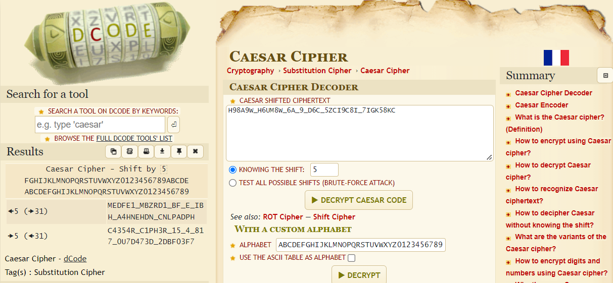

# Cryptography

- [x] [basic-mod1 (100)](#basic-mod1)
- [x] [basic-mod2 (100)](#basic-mod2)
- [x] [credstuff (100)](#credstuff)
- [x] [morse-code (100)](#morse-code)
- [x] [rail-fence (100)](#rail-fence)
- [x] [substitution0 (100)](#substitution0)
- [x] [substitution1 (100)](#substitution1)
- [x] [substitution2 (100)](#substitution2)
- [x] [transposition-trial (100)](#transposition-trial)
- [x] [Vigenere (100)](#Vigenere)
- [ ] Very Smooth (300)
- [ ] Sequences (400)
- [ ] Sum-O-Primes (400)
- [ ] NSA Backdoor (500)
- [x] [diffie-hellman](#diffie-hellman)

## basic-mod1

### *Description*

We found this weird message being passed around on the servers, we think we have a working decrpytion scheme. <br>
Download the message [here](https://artifacts.picoctf.net/c/393/message.txt). <br>
Take each number mod 37 and map it to the following character set: 0-25 is the alphabet (uppercase), 26-35 are the decimal digits, and 36 is an underscore. <br>
Wrap your decrypted message in the picoCTF flag format (i.e. `picoCTF{decrypted_message}`)

<details>
    <summary>Hint 1</summary>
    Do you know what <code>mod 37</code> means?
</details>
<details>
    <summary>Hint 2</summary>
    <code>mod 37</code> means modulo 37. It gives the remainder of a number after being divided by 37.
</details>


### *Writeup*

Make a python script that will parse the text file and mod every number.

Code for `basic-mod1.py`:

```python
with open('message.txt') as f:
    contents = f.read()
    ret = ''
    for i in contents.split():
        n = int(i) % 37
        if n <= 25:
            ret += chr(n+65)
        elif 26 <= n <= 35:
            ret += str(n-26)
        else:
            ret += '_'
    ret = 'picoCTF{'+ret+'}'
    print(ret)
```

Terminal output:

```bash
└─$ python3 basic_mod1.py
picoCTF{R0UND_N_R0UND_79C18FB3}
```

Flag: `picoCTF{R0UND_N_R0UND_79C18FB3}`

## basic-mod2

### *Description*

A new modular challenge! <br>
Download the message [here](https://artifacts.picoctf.net/c/499/message.txt). <br>
Take each number mod 41 and find the modular inverse for the result. Then map to the following character set: 1-26 are the alphabet, 27-36 are the decimal digits, and 37 is an underscore. <br>
Wrap your decrypted message in the picoCTF flag format (i.e. `picoCTF{decrypted_message}`)

<details>
    <summary>Hint 1</summary>
    Do you know what the modular inverse is?
</details>
<details>
    <summary>Hint 2</summary>
    The inverse modulo <em>z</em> of <em>x</em> is the number, <em>y</em> that when multiplied by <em>x</em> is 1 modulo <em>z</em>
</details>
<details>
    <summary>Hint 3</summary>
    It's recommended to use a tool to find the modular inverses
</details>


### *Writeup*

Make a python script that will parse the text file and mod every number and then find the modular inverse using `pow(a,-1,x)`.

Code for `basic-mod2.py`:

```python
with open('message.txt') as f:
    contents = f.read()
    ret = ''
    for i in contents.split():
        n = pow(int(i)%41, -1, 41)
        if n <= 26:
            ret += chr(n+64)
        elif 27 <= n <= 36:
            ret += str(n-27)
        else:
            ret += '_'
    ret = 'picoCTF{'+ret+'}'
    print(ret)
```

Terminal output:

```bash
└─$ python3 basic_mod2.py
picoCTF{1NV3R53LY_H4RD_C680BDC1}
```

Flag: `picoCTF{1NV3R53LY_H4RD_C680BDC1}`

## credstuff

### *Description*

We found a leak of a blackmarket website's login credentials. Can you find the password of the user `cultiris` and successfully decrypt it? <br>
Download the leak [here](https://artifacts.picoctf.net/c/534/leak.tar). <br>
The first user in `usernames.txt` corresponds to the first password in `passwords.txt`. The second user corresponds to the second password, and so on.

<details>
    <summary>Hint 1</summary>
    Maybe other passwords will have hints about the leak?
</details>


### *Writeup*

First thing to do is extract the tar file using `tar -xvf leak.tar` and then change directory into the extracted folder.

```bash
└─$ tar -xvf leak.tar
leak/
leak/passwords.txt
leak/usernames.txt
```

Use `grep -n` to not only find the user `cultiris` in `usernames.txt`, but also the line number of that user in the text file (this only works if the first user and the first password is on line 1 of their respective files).

```bash
└─$ grep -n cultiris usernames.txt
378:cultiris
```

Then, use `sed -n NUMp`, where NUM is the line number, and `p` to print the contents at that line number.

```bash
└─$ sed -n '378p' < passwords.txt
cvpbPGS{P7e1S_54I35_71Z3}
```

This looks like the flag, but isn't the flag since it does not start with picoCTF. It is actually encrypted in ROT13, so the last step is to transform the password.

```bash
└─$ sed -n '378p' < passwords.txt | tr 'A-Za-z' 'N-ZA-Mn-za-m'
picoCTF{C7r1F_54V35_71M3}
```

Flag: `picoCTF{1NV3R53LY_H4RD_C680BDC1}`

## morse-code

### *Description*

Morse code is well known. Can you decrypt this? <br>
Download the file [here](https://artifacts.picoctf.net/c/235/morse_chal.wav). <br>
Wrap your answer with picoCTF{}, put underscores in place of pauses, and use all lowercase.

<details>
    <summary>Hint 1</summary>
    Audacity is a really good program to analyze morse code audio.
</details>


### *Writeup*

After analyzing the wav file using Audacity, I can see that the waveform is split by either short or long waves. The short ones are dots and the long ones are dashes. After writing down the morse code, I used an [online morse code translator](https://morsecode.world/international/translator.html) to convert the message.

```bash
└─$ audacity morse_chal.wav
```


```
.-- .... ....- --... / .... ....- --... .... / ----. ----- -.. / .-- ..--- ----- ..- ----. .... --...
```

morse code: `WH47 H47H 90D W20U9H7`

```bash
└─$ python3
Python 3.9.10 (main, Feb 22 2022, 13:54:07)
[GCC 11.2.0] on linux
Type "help", "copyright", "credits" or "license" for more information.
>>> "picoCTF{" + "WH47 H47H 90D W20U9H7".lower().replace(" ", "_") + "}"
'picoCTF{wh47_h47h_90d_w20u9h7}'
>>>
```

Flag: `picoCTF{wh47_h47h_90d_w20u9h7}`

## rail-fence

### *Description*

A type of transposition cipher is the rail fence cipher, which is described [here](https://en.wikipedia.org/wiki/Rail_fence_cipher). Here is one such cipher encrypted using the rail fence with 4 rails. Can you decrypt it? <br>
Download the message [here](https://artifacts.picoctf.net/c/275/message.txt). <br>
Put the decoded message in the picoCTF flag format, `picoCTF{decoded_message}`.

<details>
    <summary>Hint 1</summary>
    Once you've understood how the cipher works, it's best to draw it out yourself on paper
</details>


### *Writeup*

It is really tedious to do by hand since you have to take into account of padding the plaintext, so it is better to use an online cracking tool such as the one [here](https://www.boxentriq.com/code-breaking/rail-fence-cipher). Giving 4 rails should give a result.

```
T     a           _     7     N     6     D     E     7
 h   l g   : W   3 D   _ H   3 C   3 1   N _   _ B   D 4
  e f     s   H R   0 5   3 F   3 8   N 4   3 D   4 7
         i     3     3     _     _     _     N     C
```

Flag: `picoCTF{WH3R3_D035_7H3_F3NC3_8361N_4ND_3ND_EB4C7D74}`

## substitution0

### *Description*

A message has come in but it seems to be all scrambled. Luckily it seems to have the key at the beginning. Can you crack this substitution cipher? <br>
Download the message [here](https://artifacts.picoctf.net/c/379/message.txt).

<details>
    <summary>Hint 1</summary>
    Try a frequency attack. An online tool might help.
</details>


### *Writeup*

Make a python script that will take the first line of the message and use it as the substitution key.

Code for `substitution0.py`:

```python
with open('message.txt') as f:
    letter_key = f.readline()
    contents = f.read()
    ret = ''
    letter_val = 'ABCDEFGHIJKLMNOPQRSTUVWXYZ'
    letter_map = {}

    for i in range(26):
        letter_map[letter_key[i]] = letter_val[i]

    for i in contents:
        if i.islower():
            ret += letter_map.get(i.upper()).lower()
        else:  
            if i in letter_map:
                ret += letter_map.get(i)
            else:
                ret += i
    print(letter_key + ret)
```

Terminal output:

```bash
└─$ python3 substitution0.py
EKSZJTCMXOQUDYLFABGPHNRVIW

Hereupon Legrand arose, with a grave and stately air, and brought me the beetle
from a glass case in which it was enclosed. It was a beautiful scarabaeus, and, at
that time, unknown to naturalists—of course a great prize in a scientific point
of view. There were two round black spots near one extremity of the back, and a
long one near the other. The scales were exceedingly hard and glossy, with all the
appearance of burnished gold. The weight of the insect was very remarkable, and,
taking all things into consideration, I could hardly blame Jupiter for his opinion
respecting it.

The flag is: picoCTF{5UB5717U710N_3V0LU710N_59533A2E}
```

Flag: `picoCTF{5UB5717U710N_3V0LU710N_59533A2E}`

## substitution1

### *Description*

A second message has come in the mail, and it seems almost identical to the first one. Maybe the same thing will work again.
Download the message [here](https://artifacts.picoctf.net/c/414/message.txt).

<details>
    <summary>Hint 1</summary>
    Try a frequency attack
</details>
<details>
    <summary>Hint 2</summary>
    Do the punctuation and the individual words help you make any substitutions?
</details>


### *Writeup*

Make a python script and slowly replace letters. It started with knowing that the last sentence should have the string `picoCTF{` to knowing that the sentence should include `the flag is: picoCTF{`, and then figuring out that the message has to do with talking about CTFs. It was a lot of replacing letter by letter.

Quick note: since it's a substitution cipher which means each letter maps to another letter, it's better to use a hashmap (in this case a dictionary for python) since it has a lookup time of O(1), and it's better than having 26 if statements.

Code for `substitution1.py`:

```python
with open('message.txt') as f:
    contents = f.read()
    ret = ''
    letter_key = 'XTIKSCAQDBPORYFZNUJELGHVMW'
    letter_val = 'ABCDEFGHIJKLMNOPQRSTUVWXYZ'
    letter_map = {}

    for i in range(26):
        letter_map[letter_key[i]] = letter_val[i]

    for i in contents:
        if i.islower():
            ret += letter_map.get(i.upper()).lower()
        else:  
            if i in letter_map:
                ret += letter_map.get(i)
            else:
                ret += i
    print(ret)
```

Terminal output:

```bash
└─$ python3 substitution1.py
CTFs (short for capture the flag) are a type of computer security competition. Contestants are presented with a set of challenges which test their creativity, technical (and googling) skills, and problem-solving ability. Challenges usually cover a number of categories, and when solved, each yields a string (called a flag) which is submitted to an online scoring service. CTFs are a great way to learn a wide array of computer security skills in a safe, legal environment, and are hosted and played by many security groups around the world for fun and practice. For this problem, the flag is: picoCTF{FR3QU3NCY_4774CK5_4R3_C001_4871E6FB}
```

Flag: `picoCTF{FR3QU3NCY_4774CK5_4R3_C001_4871E6FB}`

## substitution2

### *Description*

It seems that another encrypted message has been intercepted. The encryptor seems to have learned their lesson though and now there isn't any punctuation! Can you still crack the cipher? <br>
Download the message [here](https://artifacts.picoctf.net/c/107/message.txt).

<details>
    <summary>Hint 1</summary>
    Try refining your frequency attack, maybe analyzing groups of letters would improve your results?
</details>


### *Writeup*

Make a python script and slowly replace letters. It started with knowing that the last sentence should have the string `picoCTF{` to knowing that the sentence should include `theflagispicoCTF{`, and then guessing what some of the words might be using context clues. It was a lot of replacing letter by letter.

Code for `substitution2.py`:

```python
with open('message.txt') as f:
    contents = f.read()
    ret = ''
    letter_key = 'QFMIJNCVEYDXBHZPTWUGSAKORL'
    letter_val = 'ABCDEFGHIJKLMNOPQRSTUVWXYZ'
    letter_map = {}

    for i in range(26):
        letter_map[letter_key[i]] = letter_val[i]

    for i in contents:
        if i.islower():
            ret += letter_map.get(i.upper()).lower()
        else:  
            if i in letter_map:
                ret += letter_map.get(i)
            else:
                ret += i
    print(ret)
```

Terminal output:

```bash
└─$ python3 substitution2.py
thereexistseveralotherwellestablishedhighschoolcomputersecuritycompetitionsincludingcyberpatriotanduscyberchallengethesecompetitionsfocusprimarilyonsystemsadministrationfundamentalswhichareveryusefulandmarketableskillshoweverwebelievetheproperpurposeofahighschoolcomputersecuritycompetitionisnotonlytoteachvaluableskillsbutalsotogetstudentsinterestedinandexcitedaboutcomputersciencedefensivecompetitionsareoftenlaboriousaffairsandcomedowntorunningchecklistsandexecutingconfigscriptsoffenseontheotherhandisheavilyfocusedonexplorationandimprovisationandoftenhaselementsofplaywebelieveacompetitiontouchingontheoffensiveelementsofcomputersecurityisthereforeabettervehiclefortechevangelismtostudentsinamericanhighschoolsfurtherwebelievethatanunderstandingofoffensivetechnizuesisessentialformountinganeffectivedefenseandthatthetoolsandconfigurationfocusencounteredindefensivecompetitionsdoesnotleadstudentstoknowtheirenemyaseffectivelyasteachingthemtoactivelythinklikeanattackerpicoctfisanoffensivelyorientedhighschoolcomputersecuritycompetitionthatseekstogenerateinterestincomputerscienceamonghighschoolersteachingthemenoughaboutcomputersecuritytopizuetheircuriositymotivatingthemtoexploreontheirownandenablingthemtobetterdefendtheirmachinestheflagispicoCTF{N6R4M_4N41Y515_15_73D10U5_8E1BF808}
```

Flag: `picoCTF{N6R4M_4N41Y515_15_73D10U5_8E1BF808}`

## transposition-trial

### *Description*

Our data got corrupted on the way here. Luckily, nothing got replaced, but every block of 3 got scrambled around! The first word seems to be three letters long, maybe you can use that to recover the rest of the message. <br>
Download the corrupted message [here](https://artifacts.picoctf.net/c/459/message.txt).

<details>
    <summary>Hint 1</summary>
    Split the message up into blocks of 3 and see how the first block is scrambled
</details>


### *Writeup*

Analyzing the corrupted message it seems that for every block of three characters, the first characters is moved to the end (so instead of 1 2 3 it got corrupted to 2 3 1). Make a python script that will check every third character and move it two places back.

Code for `transposition-trial.py`:

```python
with open('message.txt') as f:
    contents = f.read()
    ret = ''

    for i in range(len(contents)):
        if i % 3 == 2:
            ret = ret[:i-2] + contents[i] + ret[i-2:]
        else:
            ret += contents[i]
    print(ret)
```

Terminal output:

```bash
└─$ python3 transposition-trial.py
The flag is picoCTF{7R4N5P051N6_15_3XP3N51V3_5C82A0E0}
```

Flag: `picoCTF{7R4N5P051N6_15_3XP3N51V3_5C82A0E0}`

## Vigenere

### *Description*

Can you decrypt this message?
Decrypt this [message](https://artifacts.picoctf.net/c/527/cipher.txt) using this key "CYLAB".

<details>
    <summary>Hint 1</summary>
    https://en.wikipedia.org/wiki/Vigen%C3%A8re_cipher
</details>


### *Writeup*

Make a python script that will do the Vigenere Cipher. Used the [geeksforgeeks](https://www.geeksforgeeks.org/vigenere-cipher/) page for code reference and [dcode.fr](https://www.dcode.fr/vigenere-cipher) to verify.

Code for `Vigenere.py`:

```python
def generateKey(string, key):
    key = list(key)
    if len(string) == len(key):
        return(key)
    else:
        for i in range(len(string) -
                       len(key)):
            key.append(key[i % len(key)])
    return("" . join(key))

def originalText(cipher_text, key):
    orig_text = []
    key_counter = 0
    for i in range(len(cipher_text)):
        if cipher_text[i].isupper():
            x = (ord(cipher_text[i]) -
                ord(key[key_counter]) + 26) % 26
            x += ord('A')
            key_counter += 1
            orig_text.append(chr(x))
        elif cipher_text[i].islower():
            x = (ord(cipher_text[i].upper()) -
                ord(key[key_counter]) + 26) % 26
            x += ord('A')
            key_counter += 1
            orig_text.append(chr(x).lower())
        else:
            orig_text.append(cipher_text[i])
    return("" . join(orig_text))

with open('cipher.txt') as f:
    cipher_text = f.read()

key = generateKey(cipher_text, 'CYLAB')
print(originalText(cipher_text, key))
```

Terminal output:

```bash
└─$ python3 vigenere.py cipher.txt CYLAB
picoCTF{D0NT_US3_V1G3N3R3_C1PH3R_y23c13p5}
```

Flag: `picoCTF{D0NT_US3_V1G3N3R3_C1PH3R_y23c13p5}`

## diffie-hellman

### *Description*

Alice and Bob wanted to exchange information secretly. The two of them agreed to use the Diffie-Hellman key exchange algorithm, using p = 13 and g = 5. They both chose numbers secretly where Alice chose 7 and Bob chose 3. Then, Alice sent Bob some encoded text (with both letters and digits) using the generated key as the shift amount for a Caesar cipher over the alphabet and the decimal digits. Can you figure out the contents of the message? <br>
Download the message [here](https://artifacts.picoctf.net/c/452/message.txt). <br>
Wrap your decrypted message in the picoCTF flag format like: `picoCTF{decrypted_message}`

<details>
    <summary>Hint 1</summary>
    Diffie-Hellman key exchange is a well known algorithm for generating keys, try looking up how the secret key is generated
    <summary>Hint 2</summary>
    For your Caesar shift amount, try forwards and backwards.
</details>


### *Writeup*

The challenge is to find the Caesar cipher shift, which is going to be the shared secret key in the [Diffie-Hellman key exchange](https://en.wikipedia.org/wiki/Diffie%E2%80%93Hellman_key_exchange). The information we have is `p = 13, g = 5, a = 7, b = 3`, and our goal is to find s where `A = g^a mod p, B = g^b mod p, and s = B^a mod p = A^b mod p`. We have `A = 5^7 mod 13 = 8`.

```bash
└─$ python3
Python 3.9.10 (main, Feb 22 2022, 13:54:07)
[GCC 11.2.0] on linux
Type "help", "copyright", "credits" or "license" for more information.
>>> p, g, a, b = 13, 5, 7, 3
>>> A, B = pow(g,a) % p, pow(g,b) % p
>>> s1, s2 = pow(B,a) % p, pow(A,b) % p
>>> print(s1, s2)
5 5
```

Since both s1 and s2 are 5, we are sure `s = 5` which is going to be out Caesar cipher shift. Using an online Caesar cipher tool like the one [here](https://www.dcode.fr/caesar-cipherhttps://www.dcode.fr/caesar-cipher) and changing the alphabet to `ABCDEFGHIJKLMNOPQRSTUVWXYZ0123456789`, I get a result with a shift of 5 backwards.



Alternatively, you can try to do the shift through the terminal:

```bash
└─$ echo -en "Shift 5 forwards: "; cat message.txt | tr 'A-Z0-9' 'F-Z0-9A-E' ; echo -en "\nShift 5 backwards: "; cat message.txt | tr 'F-Z0-9A-E' 'A-Z0-9'
Shift 5 forwards: MEDFE1_MBZRD1_BF_E_IBH_A4HNEHDN_CNLPADPH
Shift 5 backwards: C4354R_C1PH3R_15_4_817_0U7D473D_2DBF03F7
```

Flag: `picoCTF{C4354R_C1PH3R_15_4_817_0U7D473D_2DBF03F7}`