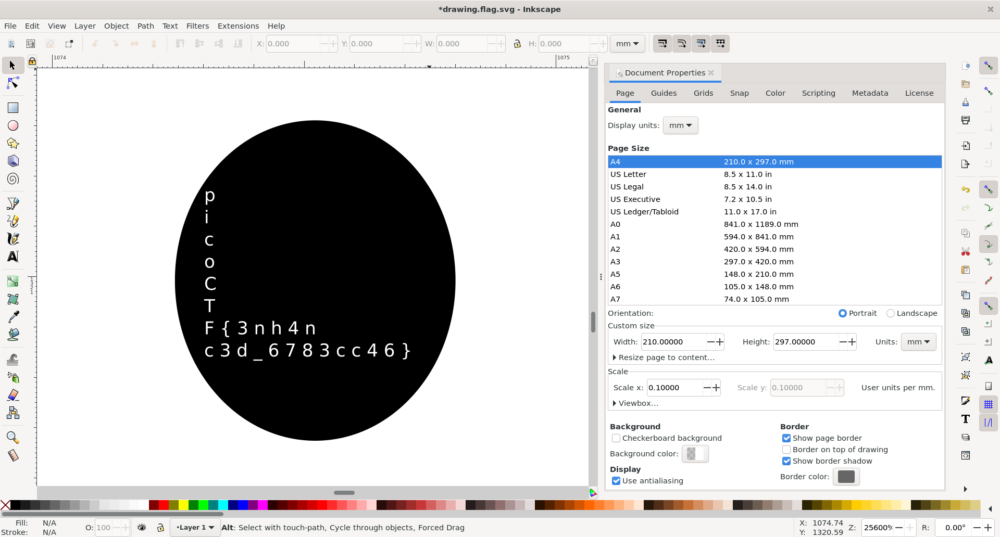
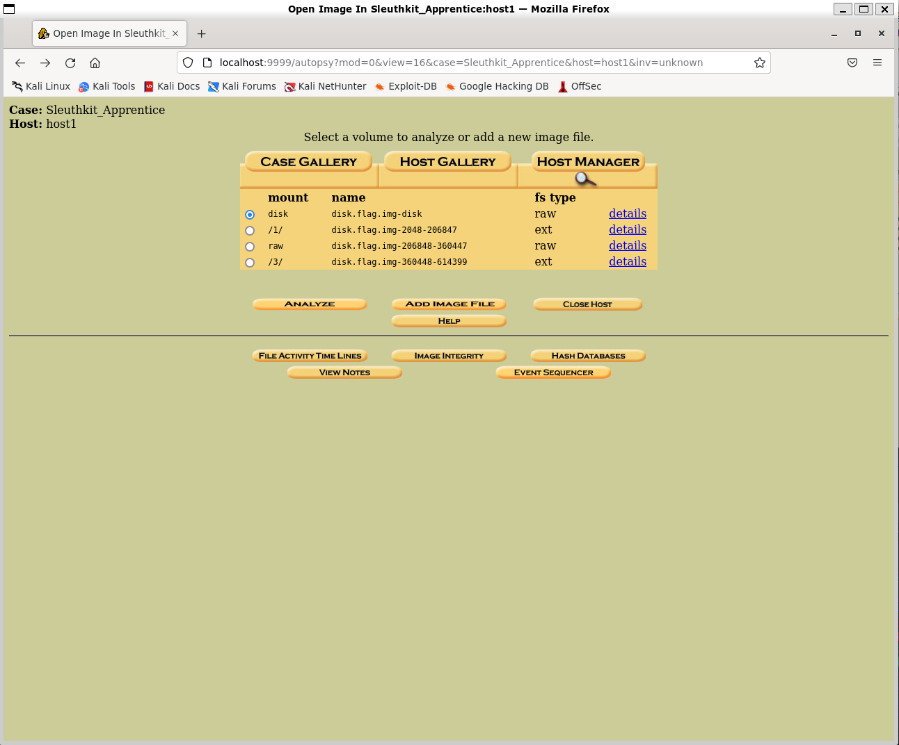

# Forensics

- [x] [Enhance! (100)](#Enhance)
- [x] [File types (100)](#File-types)
- [x] [Lookey here (100)](#Lookey-here)
- [x] [Packets Primer (100)](#Packets-Primer)
- [x] [Redaction gone wrong (100)](#Redaction-gone-wrong)
- [x] [Sleuthkit Intro (100)](#Sleuthkit-Intro)
- [x] [Sleuthkit Apprentice (200)](#Sleuthkit-Apprentice)
- [x] [Eavesdrop (300)](#Eavesdrop)
- [ ] Operation Oni (300)
- [x] [St3g0 (300)](#St3g0)
- [ ] Operation Orchard (400)
- [ ] SideChannel (400)
- [ ] Torrent Analyze (400)

## Enhance!

### *Description*

Download this image file and find the flag. <br>

- [Download image file](https://artifacts.picoctf.net/c/139/drawing.flag.svg)

### *Writeup*

First I tried viewing the SVG using eog (Eye of Gnome), but sadly even after viewing the image under 2000x magnification I was unable to find anything at the center. Therefore, I tried another tool called InkScape, and viewed it under 25600x magnification. I was able to see something within the very tiny black dot at the center of the image, but I am unable to figure out what it is. I then opened the Document Properties menu (<kbd>Ctrl+Shift+D</kbd>) and changed the scale of the document from 1.0 to 0.1, which allowed me to see the flag.

The alternative to getting the string is to cat the SVG and analyze every text and try to piece it together.

Starting InkScape on `drawing.flag.svg`:

```bash
└─$ inkscape drawing.flag.svg
```



Flag: `picoCTF{3nh4nc3d_6783cc46}`

## File types

### *Description*

This file was found among some files marked confidential but my pdf reader cannot read it, maybe yours can. <br>
You can download the file from [here](https://artifacts.picoctf.net/c/326/Flag.pdf).

<details>
    <summary>Hint 1</summary>
    Remember that some file types can contain and nest other files
</details>


### *Writeup*

Downloading and then running `file Flag.pdf` shows that it's a shell archive text, and reading the comments at the top of the file shows that to run a shell archive (shar) file you do `sh FILE`.

```bash
└─$ file Flag.pdf
Flag.pdf: shell archive text
```

```bash
└─$ cat Flag.pdf
#!/bin/sh
# This is a shell archive (produced by GNU sharutils 4.15.2).
# To extract the files from this archive, save it to some FILE, remove
# everything before the '#!/bin/sh' line above, then type 'sh FILE'.
#
...
```

Running `sh Flag.pdf` will extract a file to the current directory called `flag`. If extracting errors and says `uudecode: not found`, install `sharutils` package using `sudo apt install sharutils`.

```bash
└─$ sh Flag.pdf
x - created lock directory _sh00048.
x - extracting flag (text)
x - removed lock directory _sh00048.
```

```bash
└─$ file *
flag:     current ar archive
Flag.pdf: shell archive text
```

The rest of this is really tedious and extracting nested files.

```bash
└─$ ar -xv flag ; file *
x - flag
flag:     cpio archive
Flag.pdf: shell archive text
```

```bash
└─$ cpio -iuv < flag ; file *
flag
2 blocks
flag:     bzip2 compressed data, block size = 900k
Flag.pdf: shell archive text
```

```bash
└─$ bzip2 -dv flag ; file *
bzip2: Can't guess original name for flag -- using flag.out
  flag:    done
flag.out: gzip compressed data, was "flag", last modified: Tue Mar 15 06:50:44 2022, from Unix, original size modulo 2^32 327
Flag.pdf: shell archive text
```

```bash
└─$ gunzip -vS .out flag.out ; file *
flag.out:        -1.5% -- replaced with flag
flag:     lzip compressed data, version: 1
Flag.pdf: shell archive text
```

Have to install using `sudo apt install lzip`:

```bash
└─$ lzip -dv flag ; file *
lzip: Can't guess original name for 'flag' -- using 'flag.out'
  flag: done
flag.out: LZ4 compressed data (v1.4+)
Flag.pdf: shell archive text
```

Have to install using `sudo apt install lz4`:

```bash
└─$ unlz4 -v flag.out flag ; mv flag flag.out ; file *
*** LZ4 command line interface 64-bits v1.9.3, by Yann Collet ***
flag.out             : decoded 264 bytes
flag.out: LZMA compressed data, non-streamed, size 253
Flag.pdf: shell archive text
```

```bash
└─$ unlzma -vS .out flag.out ; file *
flag.out (1/1)
  100 %               264 B / 253 B = 1.043
flag:     lzop compressed data - version 1.040, LZO1X-1, os: Unix
Flag.pdf: shell archive text
```

Have to install using `sudo apt install lzop`:

```bash
└─$ lzop -dvff flag ; file *
decompressing flag into flag.raw
flag:     lzop compressed data - version 1.040, LZO1X-1, os: Unix
Flag.pdf: shell archive text
flag.raw: lzip compressed data, version: 1
```

```bash
└─$ lzip -dv flag.raw ; file *
lzip: Can't guess original name for 'flag.raw' -- using 'flag.raw.out'
  flag.raw: done
flag:         lzop compressed data - version 1.040, LZO1X-1, os: Unix
Flag.pdf:     shell archive text
flag.raw.out: XZ compressed data, checksum CRC64
```

```bash
└─$ unxz -vS .out flag.raw.out ; file *
flag.raw.out (1/1)
  100 %               152 B / 110 B = 1.382
flag:     lzop compressed data - version 1.040, LZO1X-1, os: Unix
Flag.pdf: shell archive text
flag.raw: ASCII text
```

Finally reached the end after 10 decompressions (I hate this). Printing teh contents of the flag.raw ASCII text file shows this:

```bash
└─$ cat flag.raw
7069636f4354467b66316c656e406d335f6d406e3170756c407431306e5f
6630725f3062326375723137795f33343765616536357d0a
```

All of that and it's still not the flag?? Looking at the string carefully though, every character is from 0-f, so it's most likely in hex. Converting from hex to ASCII should give the correct flag.

```bash
└─$ cat flag.raw | xxd -r -p
picoCTF{f1len@m3_m@n1pul@t10n_f0r_0b2cur17y_347eae65}
```

Flag: `picoCTF{f1len@m3_m@n1pul@t10n_f0r_0b2cur17y_347eae65}`

## Lookey here

### *Description*

Attackers have hidden information in a very large mass of data in the past, maybe they are still doing it. <br>
Download the data [here](https://artifacts.picoctf.net/c/297/anthem.flag.txt).

<details>
    <summary>Hint 1</summary>
    Download the file and search for the flag based on the known prefix.
</details>


### *Writeup*

Run `grep picoCTF{ anthem.flag.txt` in the terminal.

```bash
└─$ grep picoCTF{ anthem.flag.txt
      we think that the men of picoCTF{gr3p_15_@w3s0m3_4554f5f5}
```

Flag: `picoCTF{gr3p_15_@w3s0m3_4554f5f5}`

## Packets Primer

### *Description*

Download the packet capture file and use packet analysis software to find the flag.

- [Download packet capture](https://artifacts.picoctf.net/c/202/network-dump.flag.pcap)

<details>
    <summary>Hint 1</summary>
    Wireshark, if you can install and use it, is probably the most beginner friendly packet analysis software product.
</details>


### *Writeup*

Opening up the .pcap file using Wireshark and analyzing all the packets, the 4th packet has bytes that when converted to ASCII gives the flag.

Starting Wireshark on `network-dump.flag.pcap`:

```bash
└─$ wireshark network-dump.flag.pcap
```


Flag: `picoCTF{p4ck37_5h4rk_d0565941}`

## Redaction gone wrong

### *Description*

Now you DON’T see me. <br>
This [report](https://artifacts.picoctf.net/c/264/Financial_Report_for_ABC_Labs.pdf) has some critical data in it, some of which have been redacted correctly, while some were not. Can you find an important key that was not redacted properly?

<details>
    <summary>Hint 1</summary>
    How can you be sure of the redaction?
</details>


### *Writeup*

I recommend using a tool called `pdftotext` which can be found in `poppler-utils`, so go ahead and install that using `sudo apt install poppler-utils`.

```bash
└─$ pdftotext -v Financial_Report_for_ABC_Labs.pdf
pdftotext version 20.09.0
Copyright 2005-2020 The Poppler Developers - http://poppler.freedesktop.org
Copyright 1996-2011 Glyph & Cog, LLC
```

Running `pdftotext` will copy the contents in the pdf to a separate text file, so printing the text file should display everything, including all the text that was "redacted" in the PDF.

```bash
└─$ cat Financial_Report_for_ABC_Labs.txt
Financial Report for ABC Labs, Kigali, Rwanda for the year 2021.
Breakdown - Just painted over in MS word.

Cost Benefit Analysis
Credit Debit
This is not the flag, keep looking
Expenses from the
picoCTF{C4n_Y0u_S33_m3_fully}
Redacted document.
```

Flag: `picoCTF{C4n_Y0u_S33_m3_fully}`

## Sleuthkit Intro

### *Description*

Download the disk image and use `mmls` on it to find the size of the Linux partition. Connect to the remote checker service to check your answer and get the flag. <br>
Note: if you are using the webshell, download and extract the disk image into `/tmp` not your home directory. <br>

- [Download disk image](https://artifacts.picoctf.net/c/114/disk.img.gz)
- Access checker program: `nc saturn.picoctf.net 52279`

### *Writeup*

Not much to this challenge. Just extract the file and run `mmls` on it.

```bash
└─$ gunzip -v disk.img.gz
disk.img.gz:     71.7% -- replaced with disk.img
```

```bash
└─$ mmls disk.img
DOS Partition Table
Offset Sector: 0
Units are in 512-byte sectors

      Slot      Start        End          Length       Description
000:  Meta      0000000000   0000000000   0000000001   Primary Table (#0)
001:  -------   0000000000   0000002047   0000002048   Unallocated
002:  000:000   0000002048   0000204799   0000202752   Linux (0x83)
```

```bash
└─$ nc saturn.picoctf.net 52279
What is the size of the Linux partition in the given disk image?
Length in sectors: 202752
202752
Great work!
picoCTF{mm15_f7w!}
```

Flag: `picoCTF{mm15_f7w!}`

## Sleuthkit Apprentice

### *Description*

Download this disk image and find the flag.<br>Note: if you are using the webshell, download and extract the disk image into `/tmp` not your home directory.

- [Download compressed disk image](https://artifacts.picoctf.net/c/330/disk.flag.img.gz)

### *Writeup*

The first method is to mount each partition independently and look through all the files to see if there are any flag hints.

Running `mmls disk.flag.img` shows this:

```bash
└─$ mmls disk.flag.img
DOS Partition Table
Offset Sector: 0
Units are in 512-byte sectors

      Slot      Start        End          Length       Description
000:  Meta      0000000000   0000000000   0000000001   Primary Table (#0)
001:  -------   0000000000   0000002047   0000002048   Unallocated
002:  000:000   0000002048   0000206847   0000204800   Linux (0x83)
003:  000:001   0000206848   0000360447   0000153600   Linux Swap / Solaris x86 (0x82)
004:  000:002   0000360448   0000614399   0000253952   Linux (0x83)
```

Create a temporary directory for where the partition can be loaded into, like `disk.flag`. Then, mount the partition but make sure to set the offset.

```bash
└─$ sudo mount -o loop,offset=$((512*360448)) disk.flag.img disk.flag
```

However, this method is inefficient, since you would have to load in one partition, look, unmount, and then mount the next partition, which is tedious. Another method is to use the `fls` command and run `fls -o 360448 disk.flag.img` to find all the directories in that partition, and if I want to see the contents of the `root` folder then I run `fls -o 360448 disk.flag.img 1995`, where 1995 is the inode of that directory.

Instead, I recommend using the `autopsy` tool installed in Kali or just do `sudo apt install autopsy` to download the program.

Run `autopsy` in one terminal (make sure you're in root and that the process does not terminate immediately) and then open Firefox in another terminal to the URL `http://localhost:9999/autopsy` by running `firefox http://localhost:9999/autopsy`.

I created a new case with the Case Name being `Sleuthkit_Apprentice` and then added a new host with the default parameters, and then I proceeded to add the disk image. I added the directory to the disk image, and then set the Type to be Disk and Import Method to be Symlink. I did not modify any of the image file details, and finally I am greeted with a screen that looks like this:



Checking mount `/3/` or the last partition and then running a File Analysis on it and then looking for a file named `flag` shows an interesting result in `/root/my_folder/flag.uni.txt`. Looking at the contents of the file in hex shows the flag.


Also running `icat -o 360448 disk.flag.img 2371` shows the flag, where 2371 is the inode of `flag.uni.txt`.

```bash
└─$ icat -o 360448 disk.flag.img 2371
picoCTF{by73_5urf3r_3497ae6b}
```

Flag: `picoCTF{by73_5urf3r_3497ae6b}`

## Eavesdrop

### *Description*

Download this packet capture and find the flag.

- [Download packet capture](https://artifacts.picoctf.net/c/358/capture.flag.pcap)

<details>
    <summary>Hint 1</summary>
    All we know is that this packet capture includes a chat conversation and a file transfer.
</details>


### *Writeup*

Open the capture packet with Wireshark and analyze all the packets. Notice there is a TCP stream, and right clicking and Follow TCP Stream shows the following:


The command to decrypt the file is `openssl des3 -d -salt -in file.des3 -out file.txt -k supersecretpassword123`, and so all we need now is the file. Judging from the conversation it was most likely sent between "Yeah, listening." and "Sent it". Examining the 57th packet shows the following interesting bytes:


The bytes that start with `Salted__` is most likely the file we need to decrypt, so we can export that data by going to `File -> Export Packet` Bytes and then saving it as `file.des3` because that is what the command takes in as file input. Running the `file` command on it shows that it is an `openssl enc'd data with salted password`. Run the command.

```bash
└─$ openssl des3 -d -salt -in file.des3 -out file.txt -k supersecretpassword123
*** WARNING : deprecated key derivation used.
Using -iter or -pbkdf2 would be better.
```

Output the contents of `file.txt` to get the flag.

```bash
└─$ cat file.txt
picoCTF{nc_73115_411_5786acc3}
```

Flag: `picoCTF{nc_73115_411_5786acc3}`

## St3g0

### *Description*

Download this image and find the flag. <br>

- [Download image](https://artifacts.picoctf.net/c/424/pico.flag.png)

<details>
    <summary>Hint 1</summary>
    We know the end sequence of the message will be `$t3g0`.
</details>


### *Writeup*

Use a steganography detection tool like zsteg, which you can get by running `sudo apt install ruby-dev` then `gem install zsteg`. Running zsteg on the png file shows the following on the console.

```bash
└─$ zsteg pico.flag.png
b1,r,lsb,xy         .. text: "~__B>+g?G@"
b1,rgb,lsb,xy       .. text: "picoCTF{7h3r3_15_n0_5p00n_1b8d71db}$t3g0"
b1,abgr,lsb,xy      .. text: "E2A5q4E%uSA"
b2,b,lsb,xy         .. text: "AAPAAQTAAA"
b2,b,msb,xy         .. text: "HWUUUUUU"
b2,a,lsb,xy         .. file: Matlab v4 mat-file (little endian) >\004<\305P, numeric, rows 0, columns 0
b2,a,msb,xy         .. file: Matlab v4 mat-file (little endian) | <\243, numeric, rows 0, columns 0
b3,r,lsb,xy         .. file: gfxboot compiled html help file
b4,r,lsb,xy         .. file: Targa image data (16-273) 65536 x 4097 x 1 +4352 +4369 - 1-bit alpha - right "\021\020\001\001\021\021\001\001\021\021\001"
b4,g,lsb,xy         .. file: 0420 Alliant virtual executable not stripped
b4,b,lsb,xy         .. file: Targa image data - Map 272 x 17 x 16 +257 +272 - 1-bit alpha "\020\001\021\001\021\020\020\001\020\001\020\001"
b4,bgr,lsb,xy       .. file: Targa image data - Map 273 x 272 x 16 +1 +4113 - 1-bit alpha "\020\001\001\001"
b4,rgba,lsb,xy      .. file: Novell LANalyzer capture file
b4,rgba,msb,xy      .. file: Applesoft BASIC program data, first line number 8
b4,abgr,lsb,xy      .. file: Novell LANalyzer capture file
```

Flag: `picoCTF{7h3r3_15_n0_5p00n_1b8d71db}`