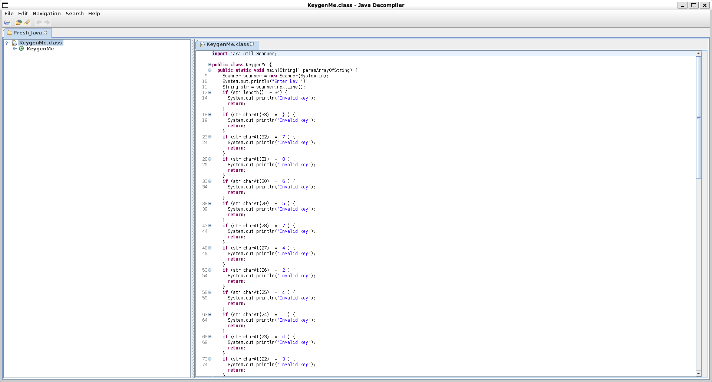

# Reverse Engineering

- [x] [file-run1 (100)](#file-run1)
- [x] [file-run2 (100)](#file-run2)
- [x] [GDB Test Drive (100)](#GDB-Test-Drive)
- [x] [patchme.py (100)](#patchmepy)
- [x] [Safe Opener (100)](#Safe-Opener)
- [x] [unpackme.py (100)](#unpackmepy)
- [x] [bloat.py (200)](#bloatpy)
- [x] [Fresh Java (200)](#Fresh-Java)
- [x] [Bbbbloat (300)](#Bbbbloat)
- [ ] unpackme (300)
- [ ] Keygenme (400)
- [ ] Wizardlike (500)

## file-run1

### *Description*

A program has been provided to you, what happens if you try to run it on the command line? <br>
Download the program [here](https://artifacts.picoctf.net/c/311/run).

<details>
    <summary>Hint 1</summary>
    To run the program at all, you must make it executable (i.e. `$ chmod +x run`)
</details>
<details>
    <summary>Hint 2</summary>
    Try running it by adding a '.' in front of the path to the file (i.e. `$ ./run`)
</details>


### *Writeup*

Give permission to execute `run` (you might not need to do this):

```bash
└─$ chmod +x run
```

Execute the `run` program in the current directory:

```bash
└─$ ./run
The flag is: picoCTF{U51N6_Y0Ur_F1r57_F113_102c30db}
```

Flag: `picoCTF{U51N6_Y0Ur_F1r57_F113_102c30db}`

## file-run2

### *Description*

Another program, but this time, it seems to want some input. What happens if you try to run it on the command line with input "Hello!"?
Download the program [here](https://artifacts.picoctf.net/c/354/run).

<details>
    <summary>Hint 1</summary>
    Try running it and add the phrase "Hello!" with a space in front (i.e. "./run Hello!")
</details>


### *Writeup*

Give permission to execute `run` and run the program with the argument "Hello!":

```bash
└─$ ./run Hello!
The flag is: picoCTF{F1r57_4rgum3n7_4653b5f6}
```

Flag: `picoCTF{F1r57_4rgum3n7_4653b5f6}`

## GDB Test Drive

### *Description*

Can you get the flag? <br>
Download this binary. <br>
Here's the test drive instructions:

- `$ chmod +x gdbme`
- `$ gdb gdbme`
- `(gdb) layout asm`
- `(gdb) break *(main+99)`
- `(gdb) run`
- `(gdb) jump *(main+104)`

### *Writeup*

Give permission to execute `gdbme` and run gdb on `gdbme`. Bring out the assembly code layout, set a breakpoint at the sleep call in the main function at address `(main+99)`, run the program which will stop at the sleep call, and the jump to the next instruction. What the gdb instructions are doing is it's jumping over the infinite sleep, whereas running the program normally will just have it be stuck on the sleep.

```
┌───────────────────────────────────────────────────────────────────────────────────────────────────────────────────────────────────┐
│   0x5555555552c7 <main>           endbr64                                                                                         │
│   0x5555555552cb <main+4>         push   %rbp                                                                                     │
│   0x5555555552cc <main+5>         mov    %rsp,%rbp                                                                                │
│   0x5555555552cf <main+8>         sub    $0x50,%rsp                                                                               │
│   0x5555555552d3 <main+12>        mov    %edi,-0x44(%rbp)                                                                         │
│   0x5555555552d6 <main+15>        mov    %rsi,-0x50(%rbp)                                                                         │
│   0x5555555552da <main+19>        mov    %fs:0x28,%rax                                                                            │
│   0x5555555552e3 <main+28>        mov    %rax,-0x8(%rbp)                                                                          │
│   0x5555555552e7 <main+32>        xor    %eax,%eax                                                                                │
│   0x5555555552e9 <main+34>        movabs $0x4c75257240343a41,%rax                                                                 │
│   0x5555555552f3 <main+44>        movabs $0x4362383846336235,%rdx                                                                 │
│   0x5555555552fd <main+54>        mov    %rax,-0x30(%rbp)                                                                         │
│   0x555555555301 <main+58>        mov    %rdx,-0x28(%rbp)                                                                         │
│   0x555555555305 <main+62>        movabs $0x6430624760433530,%rax                                                                 │
│   0x55555555530f <main+72>        movabs $0x4e3432656065365f,%rdx                                                                 │
│   0x555555555319 <main+82>        mov    %rax,-0x20(%rbp)                                                                         │
│   0x55555555531d <main+86>        mov    %rdx,-0x18(%rbp)                                                                         │
│   0x555555555321 <main+90>        movb   $0x0,-0x10(%rbp)                                                                         │
│   0x555555555325 <main+94>        mov    $0x186a0,%edi                                                                            │
│B+ 0x55555555532a <main+99>        call   0x555555555110 <sleep@plt>                                                               │
└───────────────────────────────────────────────────────────────────────────────────────────────────────────────────────────────────┘
native No process In:                                                                                                   L??   PC: ?? 
(gdb) break *(main+99)
Breakpoint 1 at 0x132a
(gdb) run
Starting program: /mnt/c/Users/jason/Documents/GitHub/picoCTF_2022/Reverse_Engineering/GDB_Test_Drive/gdbme

Breakpoint 1, 0x000055555555532a in main ()
(gdb) jump *(main+104)
Continuing at 0x55555555532f.
picoCTF{d3bugg3r_dr1v3_50e616ac}
(gdb) ior 1 (process 16883) exited normally]
```

Flag: `picoCTF{d3bugg3r_dr1v3_50e616ac}`

## patchme.py

### *Description*

Can you get the flag? <br>
Run this [Python program](https://artifacts.picoctf.net/c/389/patchme.flag.py) in the same directory as this [encrypted flag](https://artifacts.picoctf.net/c/389/flag.txt.enc).

### *Writeup*

Running `patchme.flag.py` will prompt the user for a password, which we do not have at the moment. After inspecting the python code however, lines 18-22 checks that the input that is written to `user_pw` matches a series of split strings. Piecing together the strings produces `ak98-=90adfjhgj321sleuth9000`, which is the password. Running `patchme.flag.py` again with the password gives the flag.

```bash
└─$ python3 patchme.flag.py
Please enter correct password for flag: ak98-=90adfjhgj321sleuth9000
Welcome back... your flag, user:
picoCTF{p47ch1ng_l1f3_h4ck_c3daefb9}
```

Flag: `picoCTF{p47ch1ng_l1f3_h4ck_c3daefb9}`

## **Safe Opener**

### *Description*

Can you open this safe? <br>
I forgot the key to my safe but this [program](https://artifacts.picoctf.net/c/463/SafeOpener.java) is supposed to help me with retrieving the lost key. Can you help me unlock my safe? <br>
Put the password you recover into the picoCTF flag format like:
`picoCTF{password}`

### *Writeup*

First, if running `java SafeOpener` does not work because the JDK is not installed, I recommend doing `sudo apt install default-jdk` which should install openjdk 11.0 (you can verify this by doing `java --vesion`).

After looking at the java code, I notice that the input we pass into the program is stored as `key`, and then is converted to Base64 (because `encoder` is a Base64 encoder) and stored as `encodedkey`. Finally, it checks if `encodedkey` equals `cGwzYXMzX2wzdF9tM18xbnQwX3RoM19zYWYz` in the openSafe method. In other words, the string that we pass into the program when encoded in Base64 must be equal to `cGwzYXMzX2wzdF9tM18xbnQwX3RoM19zYWYz`. The easiest way to approach this is to decode the above string from Base64 to ASCII. The following python command should do the trick.

```bash
└─$ python3
Python 3.9.10 (main, Feb 22 2022, 13:54:07)
[GCC 11.2.0] on linux
Type "help", "copyright", "credits" or "license" for more information.
>>> import base64
>>> encodedkey = "cGwzYXMzX2wzdF9tM18xbnQwX3RoM19zYWYz"
>>> base64.b64decode(encodedkey.encode('ascii')).decode('ascii')
'pl3as3_l3t_m3_1nt0_th3_saf3'
```

After getting the password, pass it back into the program to verify it is correct:

```bash
└─$ java SafeOpener.java
Enter password for the safe: pl3as3_l3t_m3_1nt0_th3_saf3
cGwzYXMzX2wzdF9tM18xbnQwX3RoM19zYWYz
Sesame open
```

Flag: `picoCTF{pl3as3_l3t_m3_1nt0_th3_saf3}`

## unpackme.py

### *Description*

Can you get the flag? <br>
Reverse engineer this [Python program](https://artifacts.picoctf.net/c/467/unpackme.flag.py).

### *Writeup*

First install the cryptography python library so that you can run the pythong program using `pip install cryptography`. Then, copy the contents of `unpackme.flag.py` to a new python file, except replace the last line of `exec(plain.decode())` to `print(plain.decode())` to see what the program is trying to execute.

```bash
└─$ python3 unpackme.py

pw = input('What\'s the password? ')

if pw == 'batteryhorse':
  print('picoCTF{175_chr157m45_188ab8c9}')
else:
  print('That password is incorrect.')
```

After getting the password, pass it back into the program to verify it is correct:

```bash
└─$ python3 unpackme.flag.py
What's the password? batteryhorse
picoCTF{175_chr157m45_188ab8c9}
```

Flag: `picoCTF{175_chr157m45_188ab8c9}`

## bloat.py

### *Description*

Can you get the flag? <br>
Run this [Python program](https://artifacts.picoctf.net/c/431/bloat.flag.py) in the same directory as this [encrypted flag](https://artifacts.picoctf.net/c/431/flag.txt.enc).

### *Writeup*

Looking at the python code for `bloat.flag.py`, I decided to use the Python shell to help convert the character concatenations with a whole string. I used python to do the job instead of looking up every index in `a`.

```bash
└─$ python3
Python 3.9.10 (main, Feb 22 2022, 13:54:07)
[GCC 11.2.0] on linux
Type "help", "copyright", "credits" or "license" for more information.
>>> a = "!\"#$%&'()*+,-./0123456789:;<=>?@ABCDEFGHIJKLMNOPQRSTUVWXYZ"+ \
     "[...             "[\\]^_`abcdefghijklmnopqrstuvwxyz{|}~ "
>>> a[71]+a[64]+a[79]+a[79]+a[88]+a[66]+a[71]+a[64]+a[77]+a[66]+a[68]
'happychance'
...
```

It seems that the program takes user input and stores it as arg432, and passes that into function arg133 and checks if the input matches the string `happychance`. If it does then the function returns True and continues and prints the flag.

```bash
└─$ python3 bloat.flag.py
Please enter correct password for flag: happychance
Welcome back... your flag, user:
picoCTF{d30bfu5c4710n_f7w_2769cf94}
```

Flag: `picoCTF{d30bfu5c4710n_f7w_2769cf94}`

## Fresh Java

### *Description*

Can you get the flag? <br>
Reverse engineer this [Java program](https://artifacts.picoctf.net/c/210/KeygenMe.class).

<details>
    <summary>Hint 1</summary>
    Use a decompiler for Java!
</details>


### *Writeup*

I recommend using the JD-GUI java decompiler using `sudo apt install jd-gui` since it comes with a gui. `javap` is also a decompiler but it only shows the method names of the .class file. 

```bash
└─$ jd-gui KeygenMe.class
```



The program looks at the input string and matches each character one by one. Piece together all the substrings and the flag should appear.

Flag: `picoCTF{700l1ng_r3qu1r3d_c2475607}`

## Bbbbloat

### *Description*

Can you get the flag? <br>
Reverse engineer this [binary](https://artifacts.picoctf.net/c/304/bbbbloat).

### *Writeup*

Opening the binary with Ghidra (`sudo apt install ghidra`, might need to do `sudo apt install default-jdk` beforehand) and going to the `.text` section of the binary, I see three functions: `FUN_00101620` pushed to register `R8`, `FUN_001015b0` to `RCX`, and `FUN_00101307` to `RDI`. The first two functions did not reveal anything, but the third function revealed something useful. It seems that in the function, it takes user input and stores in the variable `local_48`, and then checks if that variable is equal to `0x86187`. If it does not, then it prints the statement `Sorry, that's not it!`, but if it does then it seems it prints the flag. `0x861871` in decimal is 549255, which is the number the program is looking for.

```bash
└─$ python3
Python 3.9.10 (main, Feb 22 2022, 13:54:07)
[GCC 11.2.0] on linux
Type "help", "copyright", "credits" or "license" for more information.
>>> print(int('86187', 16))
549255
```

Terminal output:

```bash
└─$ ./bbbbloat
What's my favorite number? 549255
picoCTF{cu7_7h3_bl047_33e4341f}
```

Flag: `picoCTF{cu7_7h3_bl047_33e4341f}`