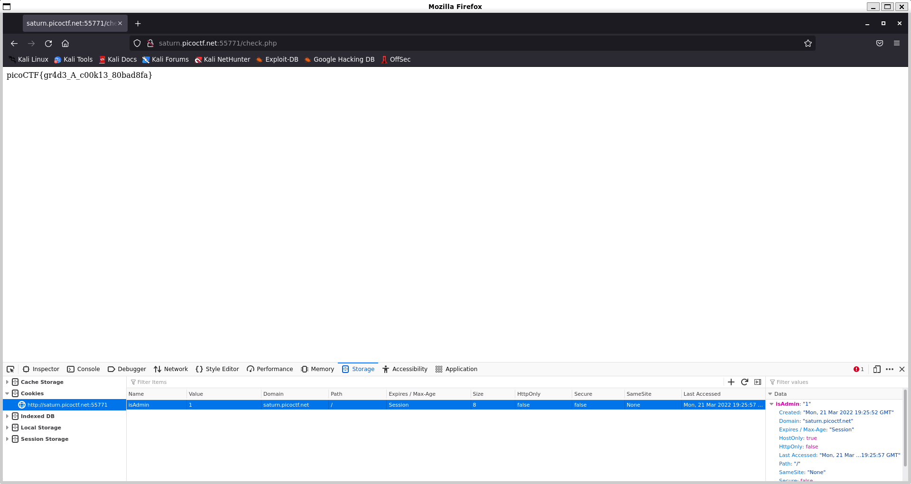
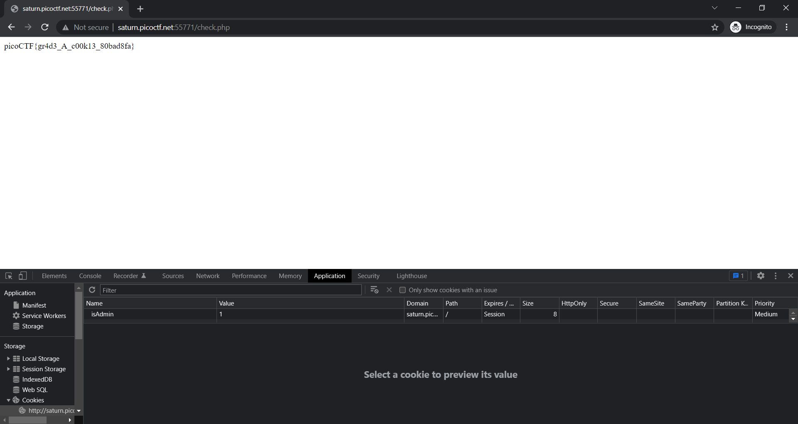

# Web Exploitation

- [x] [Includes (100)](#Includes)
- [x] [Inspect HTML (100)](#Inspect-HTML)
- [x] [Local Authority (100)](#Local-Authority)
- [x] [Search source (100)](#Search-source)
- [x] [Forbidden Paths (200)](#Forbidden-Paths)
- [x] [Power Cookie (200)](#Power-Cookie)
- [x] [Roboto Sans (200)](#Roboto-Sans)
- [x] [Secrets (200)](#Secrets)
- [x] [SQL Direct (200)](#SQL-Direct)
- [x] [SQLiLite (300)](#SQLiLite)
- [ ] Live Art (500)
- [ ] noted (500)

## Includes

### *Description*

Can you get the flag? <br>
Go to this [website](http://saturn.picoctf.net:54634/) and see what you can discover.

<details>
    <summary>Hint 1</summary>
    Is there more code than what the inspector initially shows?
</details>

### *Writeup*

Inspect `style.css` and `script.js` for parts of the flag

`style.css`:

```css
body {
  background-color: lightblue;
}

/*  picoCTF{1nclu51v17y_1of2_  */
```

`script.js`:

```js
function greetings()
{
  alert("This code is in a separate file!");
}

//  f7w_2of2_df589022}
```

Flag: `picoCTF{1nclu51v17y_1of2_f7w_2of2_df589022}`

## Inspect HTML

### *Description*

Can you get the flag? <br>
Go to this [website](http://saturn.picoctf.net:50920/) and see what you can discover.

<details>
    <summary>Hint 1</summary>
    What is the web inspector in web browsers?
</details>

### *Writeup*

Inspect the HTML source code

`index.html`:

```html
<!DOCTYPE html>
<html lang="en">
  <head>
    <meta charset="UTF-8">
    <meta name="viewport" content="width=device-width, initial-scale=1.0">
    <meta http-equiv="X-UA-Compatible" content="ie=edge">
    <title>On Histiaeus</title>
  </head>
  <body>
    <h1>On Histiaeus</h1>
    <p>However, according to Herodotus, Histiaeus was unhappy having to stay in
       Susa, and made plans to return to his position as King of Miletus by 
       instigating a revolt in Ionia. In 499 BC, he shaved the head of his 
       most trusted slave, tattooed a message on his head, and then waited for 
       his hair to grow back. The slave was then sent to Aristagoras, who was 
       instructed to shave the slave's head again and read the message, which 
       told him to revolt against the Persians.</p>
    <br>
    <p> Source: Wikipedia on Histiaeus </p>
	<!--picoCTF{1n5p3t0r_0f_h7ml_1fd8425b}-->
  </body>
</html>
```

Flag: `picoCTF{1n5p3t0r_0f_h7ml_1fd8425b}`

## Local Authority

### *Description*

Can you get the flag? <br>
Go to this [website](http://saturn.picoctf.net:65317/) and see what you can discover.

<details>
    <summary>Hint 1</summary>
    How is the password checked on this website?
</details>

### *Writeup*

Inspect the HTML source code. Notice that the form is processed in login.php, so there are two ways of getting to login.php. Either give incorrect credentials or go to `http://saturn.picoctf.net:65317/login.php`. After inspecting the php, notice that `checkPassword` will return true if the username is `admin` and the password is `strongPassword098765`. Going back to the login site and giving the correct username and password will give the flag.

`login.php`:

```html
<!DOCTYPE html>
<html lang="en">
  <head>
    <meta charset="UTF-8">
    <meta name="viewport" content="width=device-width, initial-scale=1.0">
    <meta http-equiv="X-UA-Compatible" content="ie=edge">
    <link rel="stylesheet" href="style.css">
    <title>Secure Customer Portal</title>
  </head>
  <body>

    <h1>Secure Customer Portal</h1>
    
   <p>Only letters and numbers allowed for username and password.</p>
    
    <form role="form" action="login.php" method="post">
      <input type="text" name="username" placeholder="Username" required 
       autofocus></br>
      <input type="password" name="password" placeholder="Password" required>
      <button type="submit" name="login">Login</button>
    </form>
  </body>
</html>
```

`index.html`:

```html
<!DOCTYPE html>
<html lang="en">
  <head>
    <meta charset="UTF-8">
    <meta name="viewport" content="width=device-width, initial-scale=1.0">
    <meta http-equiv="X-UA-Compatible" content="ie=edge">
    <link rel="stylesheet" href="style.css">
    <title>Login Page</title>
  </head>
  <body>
    <script src="secure.js"></script>
    
    <p id='msg'></p>
    
    <form hidden action="admin.php" method="post" id="hiddenAdminForm">
      <input type="text" name="hash" required id="adminFormHash">
    </form>
    ...
```

`secure.js`:

```js
function checkPassword(username, password)
{
  if( username === 'admin' && password === 'strongPassword098765' )
  {
    return true;
  }
  else
  {
    return false;
  }
}
```

`admin.php`:

```html
<!DOCTYPE html>
<html lang="en">
  <head>
    <meta charset="UTF-8">
    <meta name="viewport" content="width=device-width, initial-scale=1.0">
    <meta http-equiv="X-UA-Compatible" content="ie=edge">
    <link rel="stylesheet" href="style.css">
    <title>Secure Customer Portal</title>
  </head>
  <body>
    picoCTF{j5_15_7r4n5p4r3n7_8086bcb1}  </body>
</html>
```

Flag: `picoCTF{j5_15_7r4n5p4r3n7_8086bcb1}`

## Search source

### *Description*

The developer of this website mistakenly left an important artifact in the website source, can you find it? <br>
The website is [here](http://saturn.picoctf.net:58519/)

<details>
    <summary>Hint 1</summary>
    How could you mirror the website on your local machine so you could use more powerful tools for searching?
</details>

### *Writeup*

Download the website as well as the dependencies using `wget -r`, which will recursively download all the files. After running `wget -r http://saturn.picoctf.net:58519/`, running `grep -r picoCTF{ saturn.picoctf.net\:58519/` to recursively search in the cloned directory showed a match in the `css/styles.css` file.

```bash
└─$ wget -r http://saturn.picoctf.net:58519/
```

```bash
└─$ grep -r picoCTF{ saturn.picoctf.net\:58519/
saturn.picoctf.net:58519/css/style.css:/** banner_main picoCTF{1nsp3ti0n_0f_w3bpag3s_869d23af} **/
```


Flag: `picoCTF{1nsp3ti0n_0f_w3bpag3s_869d23af}`

## Forbidden Paths

### *Description*

Can you get the flag? <br>
Here's the [website](http://saturn.picoctf.net:52523/). <br>
We know that the website files live in `/usr/share/nginx/html/` and the flag is at `/flag.txt` but the website is filtering absolute file paths. Can you get past the filter to read the flag?

### *Writeup*

On the webpage, notice that giving any of the filenames on the site (`divine-comedy.txt`, `oliver-twist.txt`, and `the-happy-prince.txt`) will print the contents of that file. For example, putting in `divine-comedy.txt` most likely will do `cat /usr/share/nginx/html/divine-comedy.txt`. Also notice that the first "file" on the list is `..`, and putting that in gives a blank page. This is a good thing, as it's trying to print the contents of `/usr/share/nginx/html/..`, which is just a directory.

Giving the input `..` will go back one directory, so the webpage will print `/usr/share/nginx/`. Giving the input `../..` will print `/usr/share/`, `../../..` will print `/usr/`, `../../../..` will print `/`, and finally `../../../../flag.txt` will print the contents of `/flag.txt`. This type of attack is called a [path traversal attack](https://en.wikipedia.org/wiki/Directory_traversal_attack).

Flag: `picoCTF{7h3_p47h_70_5ucc355_e73ad00d}`

## Power Cookie

### *Description*

Can you get the flag? <br>
Go to this [website](http://saturn.picoctf.net:55771/) and see what you can discover.

<details>
    <summary>Hint 1</summary>
    Do you know how to modify cookies?
</details>

### *Writeup*

Going to the website there is a button that says `Continue as guest`, and going to it goes to `check.php` and a screen that says `We apologize, but we have no guest services at the moment.`. Looking at the cookies on Firefox by opening Web Developer Tools (<kbd>Ctrl+Shift+I</kbd>) and going to Cookies under Storage, I see there is a cookie called isAdmin with a value of 0. Changing the value from 0 to 1 and refreshing the page gives the flag.



Same idea for Google Chrome except Cookies are under Storage which is under Application.



Flag: `picoCTF{gr4d3_A_c00k13_80bad8fa}`

## Roboto Sans

### *Description*

The flag is somewhere on this web application not necessarily on the website. Find it. <br>
Check [this](http://saturn.picoctf.net:55983/) out.

### *Writeup*

Looking at the title of the challenge, I assume I would have to look at the `robots.txt` file on the webpage, so I went ahead and did that.

```
User-agent *
Disallow: /cgi-bin/
Think you have seen your flag or want to keep looking.

ZmxhZzEudHh0;anMvbXlmaW
anMvbXlmaWxlLnR4dA==
svssshjweuiwl;oiho.bsvdaslejg
Disallow: /wp-admin/
```

I see a few hidden folders like `/cgi-bin/` and `/wp-admin/` but they do not lead to anywhere sadly. The weird strings might lead to something, and I assume it is in base64 considering how the second string ends in `==`. Running `robots.txt` through a Base64 decoder python script I wrote shows the following:

```bash
└─$ python3 robots.py
User-agent *
Disallow: /cgi-bin/
Think you have seen your flag or want to keep looking.

ZmxhZzEudHh0;anMvbXlmaW
js/myfile.txt
svssshjweuiwl;oiho.bsvdaslejg
Disallow: /wp-admin/
```

The first and third string was unsuccessful in being decoded, but the second line decoded to `js/myfile.txt`. Going to that url indeed gives me the flag.

Code for `robots.py`:

```python
import base64

with open('saturn.picoctf.net:55983/robots.txt') as f:
    contents = f.readlines()
    for i in range(len(contents)):
        if (3 < i < 7):
            try:
                print(base64.b64decode(contents[i][:-1].encode('ascii')).decode('ascii'))
            except:
                print(contents[i], end="")
        else:
            print(contents[i], end="")
```

Flag: `picoCTF{Who_D03sN7_L1k5_90B0T5_6ac64608}`

## Secrets

### *Description*

We have several pages hidden. Can you find the one with the flag? <br>
The website is running [here](http://saturn.picoctf.net:52114/).

<details>
    <summary>Hint 1</summary>
    folders folders folders
</details>

### *Writeup*

Going to the page and looking at the source code, I notice that both the `index.css` and `DX1KYM.jpg` files are under the `/secret/assets/` directory. I then checked if an `index.html` file existed under that directory since that is generally the most important file on a webpage, and there is no match. I stepped back a directory, and luckily there was a `secret/index.html` file.

The page has text that says `Finally. You almost found me. you are doing well`, which means I am getting closer but I am not there yet. Looking at the source code of that shows the page uses `hidden/file.css`. I checked if `secret/hidden/index.html` existed, and I got a match. 

The page is a login form, and looking at the source code of that shows it used `superhidden/login.css`, and so checking `/secret/hidden/superhidden/index.html` gives text that says `Finally. You found me. But can you see me`. Highlighting the whole page or looking at the source code again shows the flag.

I also used `dirb` (`sudo apt install dirb`) which is a web-content scanner that looks for existing and/or hidden Web Objects through brute force of common path/file names. Using `dirb` revealed the existence of `secret/index.html` as well as `secret/hidden/index.html`, so that helped me look for a pattern for these files.

Flag: `picoCTF{succ3ss_@h3n1c@10n_f55d602d}`

## SQL Direct

### *Description*

<button name="button">Launch Instance</button> <br>
Connect to this PostgreSQL server and find the flag! <br>
`psql -h saturn.picoctf.net -p 60772 -U postgres pico` <br>
Password is `postgres`

<details>
    <summary>Hint 1</summary>
    What does a SQL database contain?
</details>

### *Writeup*

First install PostgreSQL (`sudo apt-get install postgresql-client`), and then log in to the server. Get a list of all the schemas by doing `\dt`. I see there's only one schema called `flags`, so I decided to print the whole table by running `SELECT * FROM flags` which printed the firstname, lastname, and address column, one of which is the flag.

```bash
└─$ psql -h saturn.picoctf.net -p 60772 -U postgres pico
Password for user postgres:
psql (14.2 (Debian 14.2-1))
Type "help" for help.

pico=# \dt
         List of relations
 Schema | Name  | Type  |  Owner
--------+-------+-------+----------
 public | flags | table | postgres
(1 row)

pico=# SELECT * FROM flags;
 id | firstname | lastname  |                address
----+-----------+-----------+----------------------------------------
  1 | Luke      | Skywalker | picoCTF{L3arN_S0m3_5qL_t0d4Y_34fa2564}
  2 | Leia      | Organa    | Alderaan
  3 | Han       | Solo      | Corellia
(3 rows)
```

Flag: `picoCTF{L3arN_S0m3_5qL_t0d4Y_34fa2564}`

## SQLiLite

### *Description*

<button name="button">Launch Instance</button> <br>
Can you login to this website? <br>
Try to login [here](http://saturn.picoctf.net:59901/).

<details>
    <summary>Hint 1</summary>
    `admin` is the user you want to login as.
</details>

### *Writeup*

The website brings to a Log In page that I assume stores the username and password in a SQL database. Typing in `a` for both the username and password shows a page that says `Login Failed`, but it also shows an SQL query above that says `SELECT * FROM users WHERE name='a' AND password='a'
`. If I give a username that is `' OR 1=1 --` and no input for the password, the query then becomes `SELECT * FROM users WHERE name='' OR 1=1--' AND password=''`. 

To break it down, the first statement `SELECT * FROM users WHERE name=''` may or may not return a result, but the next statement `1=1` will always return true, and an `OR` statement will always be true if one proposition is true. Therefore, the whole SQL query will return true, and anything after `1=1` is commented out to make the full statement true.

The webpage now says `Logged in! But can you see the flag, it is in plainsight.` Inspect the source code of the page of `login.php`, and it should give the flag under a `p hidden` container.

Flag: `picoCTF{L00k5_l1k3_y0u_solv3d_it_cd1df56b}`

