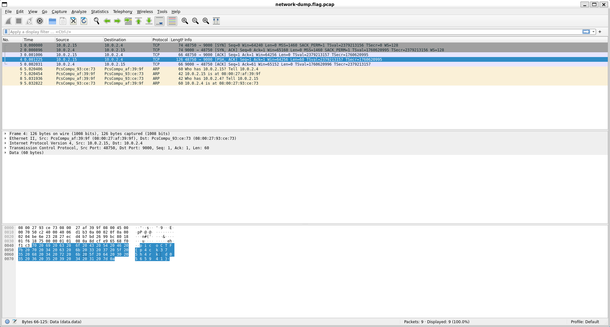
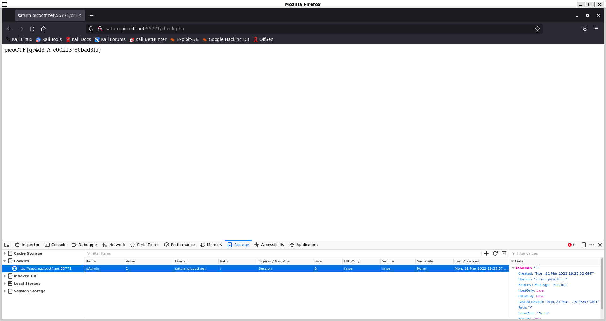

# **Table of Contents**
| Categories                                                   | Completed | Progress                                                     |
| ------------------------------------------------------------ | --------- | ------------------------------------------------------------ |
| [Binary Exploitation](#Binary_Exploitation/Binary_Exploitation.md) | 6/14      |  |
| [Cryptography](#Cryptography)                                | 10/14     |  |
| [Forensics](#Forensics)                                      | 7/13      |  |
| [Reverse Engineering](#Reverse-Engineering)                  | 9/12      |  |
| [Web Exploitation](#Web-Exploitation)                        | 10/12     |  |

# **Cryptography**
- [basic-mod1](#basic-mod1)
- [basic-mod2](#basic-mod2)
- [credstuff](#credstuff)
- [morse-code](#morse-code)
- [rail-fence](#rail-fence)
- [substitution0](#substitution0)
- [substitution1](#substitution1)
- [substitution2](#substitution2)
- [transposition-trial](#transposition-trial)
- [Vigenere](#Vigenere)
- [diffie-hellman](#diffie-hellman)

## **basic-mod1**

### ***Description***
We found this weird message being passed around on the servers, we think we have a working decrpytion scheme. <br>
Download the message [here](https://artifacts.picoctf.net/c/393/message.txt). <br>
Take each number mod 37 and map it to the following character set: 0-25 is the alphabet (uppercase), 26-35 are the decimal digits, and 36 is an underscore. <br>
Wrap your decrypted message in the picoCTF flag format (i.e. `picoCTF{decrypted_message}`)
<details>
    <summary>Hint 1</summary>
    Do you know what <code>mod 37</code> means?
</details>
<details>
    <summary>Hint 2</summary>
    <code>mod 37</code> means modulo 37. It gives the remainder of a number after being divided by 37.
</details>

### ***Writeup***
Make a [python script](./Cryptography/basic-mod1/basic_mod1.py) that will parse the text file and mod every number.

`message.txt`:
```bash
└─$ cat message.txt
54 396 131 198 225 258 87 258 128 211 57 235 114 258 144 220 39 175 330 338 297 288
```
output of `basic_mod1.py`:
```bash
└─$ python3 basic_mod1.py
picoCTF{R0UND_N_R0UND_79C18FB3}
```

Flag: `picoCTF{R0UND_N_R0UND_79C18FB3}`

## **basic-mod2**

### ***Description***
A new modular challenge! <br>
Download the message [here](https://artifacts.picoctf.net/c/499/message.txt). <br>
Take each number mod 41 and find the modular inverse for the result. Then map to the following character set: 1-26 are the alphabet, 27-36 are the decimal digits, and 37 is an underscore. <br>
Wrap your decrypted message in the picoCTF flag format (i.e. `picoCTF{decrypted_message}`)
<details>
    <summary>Hint 1</summary>
    Do you know what the modular inverse is?
</details>
<details>
    <summary>Hint 2</summary>
    The inverse modulo <em>z</em> of <em>x</em> is the number, <em>y</em> that when multiplied by <em>x</em> is 1 modulo <em>z</em>
</details>
<details>
    <summary>Hint 3</summary>
    It's recommended to use a tool to find the modular inverses
</details>

### ***Writeup***
Make a [python script](./Cryptography/basic-mod2/basic_mod2.py) that will parse the text file and mod every number and then find the modular inverse using `pow(a,-1,x)`.

`message.txt`:
```bash
└─$ cat message.txt
268 413 110 190 426 419 108 229 310 379 323 373 385 236 92 96 169 321 284 185 154 137 186
```
output of `basic_mod2.py`:
```bash
└─$ python3 basic_mod2.py
picoCTF{1NV3R53LY_H4RD_C680BDC1}
```

Flag: `picoCTF{1NV3R53LY_H4RD_C680BDC1}`

## **credstuff**

### ***Description***
We found a leak of a blackmarket website's login credentials. Can you find the password of the user `cultiris` and successfully decrypt it? <br>
Download the leak [here](https://artifacts.picoctf.net/c/534/leak.tar). <br>
The first user in `usernames.txt` corresponds to the first password in `passwords.txt`. The second user corresponds to the second password, and so on.
<details>
    <summary>Hint 1</summary>
    Maybe other passwords will have hints about the leak?
</details>

### ***Writeup***

First thing to do is extract the tar file using `tar -xvf leak.tar` and then change directory into the extracted folder.

```
└─$ tar -xvf leak.tar
leak/
leak/passwords.txt
leak/usernames.txt
```

Use `grep -n` to not only find the user `cultiris` in `usernames.txt`, but also the line number of that user in the text file (this only works if the first user and the first password is on line 1 of their respective files).

```
└─$ grep -n cultiris usernames.txt
378:cultiris
```

Then, use `sed -n NUMp`, where NUM is the line number, and `p` to print the contents at that line number.

```
└─$ sed -n '378p' < passwords.txt
cvpbPGS{P7e1S_54I35_71Z3}
```

This looks like the flag, but isn't the flag since it does not start with picoCTF. It is actually encrypted in ROT13, so the last step is to transform the password.

```
└─$ sed -n '378p' < passwords.txt | tr 'A-Za-z' 'N-ZA-Mn-za-m'
picoCTF{C7r1F_54V35_71M3}
```

Flag: `picoCTF{1NV3R53LY_H4RD_C680BDC1}`

## **morse-code**

### ***Description***
Morse code is well known. Can you decrypt this? <br>
Download the file [here](https://artifacts.picoctf.net/c/235/morse_chal.wav). <br>
Wrap your answer with picoCTF{}, put underscores in place of pauses, and use all lowercase.
<details>
    <summary>Hint 1</summary>
    Audacity is a really good program to analyze morse code audio.
</details>

### ***Writeup***
After analyzing the wav file using Audacity, I can see that the waveform is split by either short or long waves. The short ones are dots and the long ones are dashes. After writing down the morse code, I used an [online morse code translator](https://morsecode.world/international/translator.html) to convert the message.

```
└─$ audacity morse_chal.wav
```


```
.-- .... ....- --... / .... ....- --... .... / ----. ----- -.. / .-- ..--- ----- ..- ----. .... --...
```
morse code: `WH47 H47H 90D W20U9H7`

```
└─$ python3
Python 3.9.10 (main, Feb 22 2022, 13:54:07)
[GCC 11.2.0] on linux
Type "help", "copyright", "credits" or "license" for more information.
>>> "picoCTF{" + "WH47 H47H 90D W20U9H7".lower().replace(" ", "_") + "}"
'picoCTF{wh47_h47h_90d_w20u9h7}'
>>>
```

Flag: `picoCTF{wh47_h47h_90d_w20u9h7}`

## **rail-fence**

### ***Description***
A type of transposition cipher is the rail fence cipher, which is described [here](https://en.wikipedia.org/wiki/Rail_fence_cipher). Here is one such cipher encrypted using the rail fence with 4 rails. Can you decrypt it? <br>
Download the message [here](https://artifacts.picoctf.net/c/275/message.txt). <br>
Put the decoded message in the picoCTF flag format, `picoCTF{decoded_message}`.
<details>
    <summary>Hint 1</summary>
    Once you've understood how the cipher works, it's best to draw it out yourself on paper
</details>

### ***Writeup***
It is really tedious to do by hand since you have to take into account of padding the plaintext, so it is better to use an online cracking tool such as the one [here](https://www.boxentriq.com/code-breaking/rail-fence-cipher). Giving 4 rails should give a result.

```
T     a           _     7     N     6     D     E     7
 h   l g   : W   3 D   _ H   3 C   3 1   N _   _ B   D 4
  e f     s   H R   0 5   3 F   3 8   N 4   3 D   4 7
         i     3     3     _     _     _     N     C
```

Flag: `picoCTF{WH3R3_D035_7H3_F3NC3_8361N_4ND_3ND_EB4C7D74}`

## **substitution0**

### ***Description***
A message has come in but it seems to be all scrambled. Luckily it seems to have the key at the beginning. Can you crack this substitution cipher? <br>
Download the message [here](https://artifacts.picoctf.net/c/379/message.txt).
<details>
    <summary>Hint 1</summary>
    Try a frequency attack. An online tool might help.
</details>

### ***Writeup***
Make a [python script](./Cryptography/substitution0/substitution0.py) that will take the first line of the message and use it as the substitution key.

`message.txt`:
```
└─$ cat message.txt
EKSZJTCMXOQUDYLFABGPHNRVIW

Mjbjhfly Ujcbeyz eblgj, rxpm e cbenj eyz gpepjui exb, eyz kblhcmp dj pmj kjjpuj
tbld e cuegg segj xy rmxsm xp reg jysulgjz. Xp reg e kjehpxthu gsebekejhg, eyz, ep
pmep pxdj, hyqylry pl yephbeuxgpg—lt slhbgj e cbjep fbxwj xy e gsxjypxtxs flxyp
lt nxjr. Pmjbj rjbj prl blhyz kuesq gflpg yjeb lyj jvpbjdxpi lt pmj kesq, eyz e
ulyc lyj yjeb pmj lpmjb. Pmj gseujg rjbj jvsjjzxycui mebz eyz culggi, rxpm euu pmj
effjebeysj lt khbyxgmjz cluz. Pmj rjxcmp lt pmj xygjsp reg njbi bjdebqekuj, eyz,
peqxyc euu pmxycg xypl slygxzjbepxly, X slhuz mebzui kuedj Ohfxpjb tlb mxg lfxyxly
bjgfjspxyc xp.

Pmj tuec xg: fxslSPT{5HK5717H710Y_3N0UH710Y_59533E2J}
```
output of `substitution0.py`:
```
└─$ python3 substitution0.py
EKSZJTCMXOQUDYLFABGPHNRVIW

Hereupon Legrand arose, with a grave and stately air, and brought me the beetle
from a glass case in which it was enclosed. It was a beautiful scarabaeus, and, at
that time, unknown to naturalists—of course a great prize in a scientific point
of view. There were two round black spots near one extremity of the back, and a
long one near the other. The scales were exceedingly hard and glossy, with all the
appearance of burnished gold. The weight of the insect was very remarkable, and,
taking all things into consideration, I could hardly blame Jupiter for his opinion
respecting it.

The flag is: picoCTF{5UB5717U710N_3V0LU710N_59533A2E}
```

Flag: `picoCTF{5UB5717U710N_3V0LU710N_59533A2E}`

## **substitution1**

### ***Description***
A second message has come in the mail, and it seems almost identical to the first one. Maybe the same thing will work again.
Download the message [here](https://artifacts.picoctf.net/c/414/message.txt).
<details>
    <summary>Hint 1</summary>
    Try a frequency attack
</details>
<details>
    <summary>Hint 2</summary>
    Do the punctuation and the individual words help you make any substitutions?
</details>

### ***Writeup***
Make a [python script](./Cryptography/substitution1/substitution1.py) and slowly replace letters. It started with knowing that the last sentence should have the string `picoCTF{` to knowing that the sentence should include `the flag is: picoCTF{`, and then figuring out that the message has to do with talking about CTFs. It was a lot of replacing letter by letter.

Quick note: since it's a substitution cipher which means each letter maps to another letter, it's better to use a hashmap (in this case a dictionary for python) since it has a lookup time of O(1), and it's better than having 26 if statements.

`message.txt`:
```
└─$ cat message.txt
IECj (jqfue cfu ixzelus eqs coxa) xus x emzs fc ifrzlesu jsiludem ifrzsededfy. Ifyesjexyej xus zusjsyesk hdeq x jse fc iqxoosyasj hqdiq esje eqsdu iusxedgdem, esiqydixo (xyk affaodya) jpdooj, xyk zuftosr-jfogdya xtdodem. Iqxoosyasj ljlxoom ifgsu x ylrtsu fc ixesafudsj, xyk hqsy jfogsk, sxiq mdsokj x jeudya (ixoosk x coxa) hqdiq dj jltrdeesk ef xy fyodys jifudya jsugdis. IECj xus x ausxe hxm ef osxuy x hdks xuuxm fc ifrzlesu jsiludem jpdooj dy x jxcs, osaxo sygdufyrsye, xyk xus qfjesk xyk zoxmsk tm rxym jsiludem auflzj xuflyk eqs hfuok cfu cly xyk zuxiedis. Cfu eqdj zuftosr, eqs coxa dj: zdifIEC{CU3NL3YIM_4774IP5_4U3_I001_4871S6CT}
```
output of `substitution1.py`:
```
└─$ python3 substitution1.py
CTFs (short for capture the flag) are a type of computer security competition. Contestants are presented with a set of challenges which test their creativity, technical (and googling) skills, and problem-solving ability. Challenges usually cover a number of categories, and when solved, each yields a string (called a flag) which is submitted to an online scoring service. CTFs are a great way to learn a wide array of computer security skills in a safe, legal environment, and are hosted and played by many security groups around the world for fun and practice. For this problem, the flag is: picoCTF{FR3QU3NCY_4774CK5_4R3_C001_4871E6FB}
```

Flag: `picoCTF{FR3QU3NCY_4774CK5_4R3_C001_4871E6FB}`

## **substitution2**

### ***Description***
It seems that another encrypted message has been intercepted. The encryptor seems to have learned their lesson though and now there isn't any punctuation! Can you still crack the cipher? <br>
Download the message [here](https://artifacts.picoctf.net/c/107/message.txt).
<details>
    <summary>Hint 1</summary>
    Try refining your frequency attack, maybe analyzing groups of letters would improve your results?
</details>

### ***Writeup***
Make a [python script](./Cryptography/substitution2/substitution2.py) and slowly replace letters. It started with knowing that the last sentence should have the string `picoCTF{` to knowing that the sentence should include `theflagispicoCTF{`, and then guessing what some of the words might be using context clues. It was a lot of replacing letter by letter.

`message.txt`:
```
└─$ cat message.txt
gvjwjjoeugujajwqxzgvjwkjxxjugqfxeuvjivecvumvzzxmzbpsgjwujmswegrmzbpjgegezhuehmxsiehcmrfjwpqgwezgqhisumrfjwmvqxxjhcjgvjujmzbpjgegezhunzmsupwebqwexrzhurugjbuqibeheugwqgezhnshiqbjhgqxukvemvqwjajwrsujnsxqhibqwdjgqfxjudexxuvzkjajwkjfjxejajgvjpwzpjwpswpzujznqvecvumvzzxmzbpsgjwujmswegrmzbpjgegezheuhzgzhxrgzgjqmvaqxsqfxjudexxufsgqxuzgzcjgugsijhguehgjwjugjiehqhijomegjiqfzsgmzbpsgjwumejhmjijnjhueajmzbpjgegezhuqwjzngjhxqfzwezsuqnnqewuqhimzbjizkhgzwshhehcmvjmdxeuguqhijojmsgehcmzhnecumwepguznnjhujzhgvjzgvjwvqhieuvjqaexrnzmsujizhjopxzwqgezhqhiebpwzaeuqgezhqhizngjhvqujxjbjhguznpxqrkjfjxejajqmzbpjgegezhgzsmvehczhgvjznnjhueajjxjbjhguznmzbpsgjwujmswegreugvjwjnzwjqfjggjwajvemxjnzwgjmvjaqhcjxeubgzugsijhguehqbjwemqhvecvumvzzxunswgvjwkjfjxejajgvqgqhshijwugqhiehcznznnjhueajgjmvhelsjueujuujhgeqxnzwbzshgehcqhjnnjmgeajijnjhujqhigvqggvjgzzxuqhimzhnecswqgezhnzmsujhmzshgjwjiehijnjhueajmzbpjgegezhuizjuhzgxjqiugsijhgugzdhzkgvjewjhjbrqujnnjmgeajxrqugjqmvehcgvjbgzqmgeajxrgvehdxedjqhqggqmdjwpemzmgneuqhznnjhueajxrzwejhgjivecvumvzzxmzbpsgjwujmswegrmzbpjgegezhgvqgujjdugzcjhjwqgjehgjwjugehmzbpsgjwumejhmjqbzhcvecvumvzzxjwugjqmvehcgvjbjhzscvqfzsgmzbpsgjwujmswegrgzpelsjgvjewmswezuegrbzgeaqgehcgvjbgzjopxzwjzhgvjewzkhqhijhqfxehcgvjbgzfjggjwijnjhigvjewbqmvehjugvjnxqceupemzMGN{H6W4B_4H41R515_15_73I10S5_8J1FN808}
```
output of `substitution2.py`:
```
└─$ python3 substitution2.py
thereexistseveralotherwellestablishedhighschoolcomputersecuritycompetitionsincludingcyberpatriotanduscyberchallengethesecompetitionsfocusprimarilyonsystemsadministrationfundamentalswhichareveryusefulandmarketableskillshoweverwebelievetheproperpurposeofahighschoolcomputersecuritycompetitionisnotonlytoteachvaluableskillsbutalsotogetstudentsinterestedinandexcitedaboutcomputersciencedefensivecompetitionsareoftenlaboriousaffairsandcomedowntorunningchecklistsandexecutingconfigscriptsoffenseontheotherhandisheavilyfocusedonexplorationandimprovisationandoftenhaselementsofplaywebelieveacompetitiontouchingontheoffensiveelementsofcomputersecurityisthereforeabettervehiclefortechevangelismtostudentsinamericanhighschoolsfurtherwebelievethatanunderstandingofoffensivetechnizuesisessentialformountinganeffectivedefenseandthatthetoolsandconfigurationfocusencounteredindefensivecompetitionsdoesnotleadstudentstoknowtheirenemyaseffectivelyasteachingthemtoactivelythinklikeanattackerpicoctfisanoffensivelyorientedhighschoolcomputersecuritycompetitionthatseekstogenerateinterestincomputerscienceamonghighschoolersteachingthemenoughaboutcomputersecuritytopizuetheircuriositymotivatingthemtoexploreontheirownandenablingthemtobetterdefendtheirmachinestheflagispicoCTF{N6R4M_4N41Y515_15_73D10U5_8E1BF808}
```

Flag: `picoCTF{N6R4M_4N41Y515_15_73D10U5_8E1BF808}`

## **transposition-trial**

### ***Description***
Our data got corrupted on the way here. Luckily, nothing got replaced, but every block of 3 got scrambled around! The first word seems to be three letters long, maybe you can use that to recover the rest of the message. <br>
Download the corrupted message [here](https://artifacts.picoctf.net/c/459/message.txt).
<details>
    <summary>Hint 1</summary>
    Split the message up into blocks of 3 and see how the first block is scrambled
</details>

### ***Writeup***
Analyzing the corrupted message it seems that for every block of three characters, the first characters is moved to the end (so instead of 1 2 3 it got corrupted to 2 3 1). Make a [python script](./Cryptography/transposition-trial/transposition-trial.py) that will check every third character and move it two places back.

```
└─$ python3 transposition-trial.py
The flag is picoCTF{7R4N5P051N6_15_3XP3N51V3_5C82A0E0}
```

Flag: `picoCTF{7R4N5P051N6_15_3XP3N51V3_5C82A0E0}`

## **Vigenere**

### ***Description***
Can you decrypt this message?
Decrypt this [message](https://artifacts.picoctf.net/c/527/cipher.txt) using this key "CYLAB".
<details>
    <summary>Hint 1</summary>
    https://en.wikipedia.org/wiki/Vigen%C3%A8re_cipher
</details>

### ***Writeup***
Make a [python script](./Cryptography/Vigenere/vigenere.py) that will do the Vigenere Cipher. Used the [geeksforgeeks](https://www.geeksforgeeks.org/vigenere-cipher/) page for code reference and [dcode.fr](https://www.dcode.fr/vigenere-cipher) to verify.

`message.txt`:
```
└─$ cat cipher.txt
rgnoDVD{O0NU_WQ3_G1G3O3T3_A1AH3S_a23a13a5}
```
output of `vigenere.py`:
```
└─$ python3 vigenere.py cipher.txt CYLAB
picoCTF{D0NT_US3_V1G3N3R3_C1PH3R_y23c13p5}
```

Flag: `picoCTF{D0NT_US3_V1G3N3R3_C1PH3R_y23c13p5}`

## **diffie-hellman**

### ***Description***
Alice and Bob wanted to exchange information secretly. The two of them agreed to use the Diffie-Hellman key exchange algorithm, using p = 13 and g = 5. They both chose numbers secretly where Alice chose 7 and Bob chose 3. Then, Alice sent Bob some encoded text (with both letters and digits) using the generated key as the shift amount for a Caesar cipher over the alphabet and the decimal digits. Can you figure out the contents of the message? <br>
Download the message [here](https://artifacts.picoctf.net/c/452/message.txt). <br>
Wrap your decrypted message in the picoCTF flag format like: `picoCTF{decrypted_message}`
<details>
    <summary>Hint 1</summary>
    Diffie-Hellman key exchange is a well known algorithm for generating keys, try looking up how the secret key is generated
    <summary>Hint 2</summary>
    For your Caesar shift amount, try forwards and backwards.
</details>

### ***Writeup***
The challenge is to find the Caesar cipher shift, which is going to be the shared secret key in the [Diffie-Hellman key exchange](https://en.wikipedia.org/wiki/Diffie%E2%80%93Hellman_key_exchange). The information we have is `p = 13, g = 5, a = 7, b = 3`, and our goal is to find s where `A = g^a mod p, B = g^b mod p, and s = B^a mod p = A^b mod p`. We have `A = 5^7 mod 13 = 8`.

```
└─$ python3
Python 3.9.10 (main, Feb 22 2022, 13:54:07)
[GCC 11.2.0] on linux
Type "help", "copyright", "credits" or "license" for more information.
>>> p, g, a, b = 13, 5, 7, 3
>>> A, B = pow(g,a) % p, pow(g,b) % p
>>> s1, s2 = pow(B,a) % p, pow(A,b) % p
>>> print(s1, s2)
5 5
```

Since both s1 and s2 are 5, we are sure `s = 5` which is going to be out Caesar cipher shift. Using an online Caesar cipher tool like the one [here](https://www.dcode.fr/caesar-cipherhttps://www.dcode.fr/caesar-cipher) and changing the alphabet to `ABCDEFGHIJKLMNOPQRSTUVWXYZ0123456789`, I get a result with a shift of 5 backwards.


Alternatively, you can try to do the shift through the terminal:

```
└─$ echo -en "Shift 5 forwards: "; cat message.txt | tr 'A-Z0-9' 'F-Z0-9A-E' ; echo -en "\nShift 5 backwards: "; cat mes
sage.txt | tr 'F-Z0-9A-E' 'A-Z0-9'
Shift 5 forwards: MEDFE1_MBZRD1_BF_E_IBH_A4HNEHDN_CNLPADPH
Shift 5 backwards: C4354R_C1PH3R_15_4_817_0U7D473D_2DBF03F7
```

Flag: `C4354R_C1PH3R_15_4_817_0U7D473D_2DBF03F7`

# **Forensics**
- [Enhance!](#Enhance)
- [File types](#File-types)
- [Lookey here](#Lookey-here)
- [Packets Primer](#Packets-Primer)
- [Redaction gone wrong](#Redaction-gone-wrong)
- [Sleuthkit Intro](#Sleuthkit-Intro)
- [St3g0](#St3g0)

## **Enhance!**

### ***Description***
Download this image file and find the flag. <br>
- [Download image file](https://artifacts.picoctf.net/c/139/drawing.flag.svg)

### ***Writeup***
First I tried viewing the SVG using eog (Eye of Gnome), but sadly even after viewing the image under 2000x magnification I was unable to find anything at the center. Therefore, I tried another tool called InkScape, and viewed it under 25600x magnification. I was able to see something within the very tiny black dot at the center of the image, but I am unable to figure out what it is. I then opened the Document Properties menu (<kbd>Ctrl</kbd> + <kbd>Shift</kbd> + <kbd>D</kbd>) and changed the scale of the document from 1.0 to 0.1, which allowed me to see the flag.

The alternative to getting the string is to cat the SVG and analyze every text and try to piece it together.

Starting InkScape on `drawing.flag.svg`:
```
└─$ inkscape drawing.flag.svg
```


Flag: `picoCTF{3nh4nc3d_6783cc46}`

## **File types**

### ***Description***
This file was found among some files marked confidential but my pdf reader cannot read it, maybe yours can. <br>
You can download the file from [here](https://artifacts.picoctf.net/c/326/Flag.pdf).
<details>
    <summary>Hint 1</summary>
    Remember that some file types can contain and nest other files
</details>

### ***Writeup***
Downloading and then running `file Flag.pdf` shows that it's a shell archive text, and reading the comments at the top of the file shows that to run a shell archive (shar) file you do `sh FILE`.

```
└─$ file Flag.pdf
Flag.pdf: shell archive text
```

```
└─$ cat Flag.pdf
#!/bin/sh
# This is a shell archive (produced by GNU sharutils 4.15.2).
# To extract the files from this archive, save it to some FILE, remove
# everything before the '#!/bin/sh' line above, then type 'sh FILE'.
#
...
```

Running `sh Flag.pdf` will extract a file to the current directory called `flag`. If extracting errors and says `uudecode: not found`, install `sharutils` package using `sudo apt install sharutils`.

```
└─$ sh Flag.pdf
x - created lock directory _sh00048.
x - extracting flag (text)
x - removed lock directory _sh00048.
```

```
└─$ file *
flag:     current ar archive
Flag.pdf: shell archive text
```

The rest of this is really tedious and extracting nested files.

```
└─$ ar -xv flag ; file *
x - flag
flag:     cpio archive
Flag.pdf: shell archive text
```

```
└─$ cpio -iuv < flag ; file *
flag
2 blocks
flag:     bzip2 compressed data, block size = 900k
Flag.pdf: shell archive text
```

```
└─$ bzip2 -dv flag ; file *
bzip2: Can't guess original name for flag -- using flag.out
  flag:    done
flag.out: gzip compressed data, was "flag", last modified: Tue Mar 15 06:50:44 2022, from Unix, original size modulo 2^32 327
Flag.pdf: shell archive text
```

```
└─$ gunzip -vS .out flag.out ; file *
flag.out:        -1.5% -- replaced with flag
flag:     lzip compressed data, version: 1
Flag.pdf: shell archive text
```

Have to install using `sudo apt install lzip`:
```
└─$ lzip -dv flag ; file *
lzip: Can't guess original name for 'flag' -- using 'flag.out'
  flag: done
flag.out: LZ4 compressed data (v1.4+)
Flag.pdf: shell archive text
```

Have to install using `sudo apt install lz4`
```
└─$ unlz4 -v flag.out flag ; mv flag flag.out ; file *
*** LZ4 command line interface 64-bits v1.9.3, by Yann Collet ***
flag.out             : decoded 264 bytes
flag.out: LZMA compressed data, non-streamed, size 253
Flag.pdf: shell archive text
```

```
└─$ unlzma -vS .out flag.out ; file *
flag.out (1/1)
  100 %               264 B / 253 B = 1.043
flag:     lzop compressed data - version 1.040, LZO1X-1, os: Unix
Flag.pdf: shell archive text
```

Have to install using `sudo apt install lzop`
```
└─$ lzop -dvff flag ; file *
decompressing flag into flag.raw
flag:     lzop compressed data - version 1.040, LZO1X-1, os: Unix
Flag.pdf: shell archive text
flag.raw: lzip compressed data, version: 1
```

```
└─$ lzip -dv flag.raw ; file *
lzip: Can't guess original name for 'flag.raw' -- using 'flag.raw.out'
  flag.raw: done
flag:         lzop compressed data - version 1.040, LZO1X-1, os: Unix
Flag.pdf:     shell archive text
flag.raw.out: XZ compressed data, checksum CRC64
```

```
└─$ unxz -vS .out flag.raw.out ; file *
flag.raw.out (1/1)
  100 %               152 B / 110 B = 1.382
flag:     lzop compressed data - version 1.040, LZO1X-1, os: Unix
Flag.pdf: shell archive text
flag.raw: ASCII text
```

Finally reached the end after 10 decompressions (I hate this). Printing teh contents of the flag.raw ASCII text file shows this:
```
└─# cat flag.raw
7069636f4354467b66316c656e406d335f6d406e3170756c407431306e5f
6630725f3062326375723137795f33343765616536357d0a
```

All of that and it's still not the flag?? Looking at the string carefully though, every character is from 0-f, so it's most likely in hex. Converting from hex to ASCII should give the correct flag.

```
└─$ cat flag.raw | xxd -r -p
picoCTF{f1len@m3_m@n1pul@t10n_f0r_0b2cur17y_347eae65}
```

Flag: `picoCTF{f1len@m3_m@n1pul@t10n_f0r_0b2cur17y_347eae65}`

## **Lookey here**

### ***Description***
Attackers have hidden information in a very large mass of data in the past, maybe they are still doing it. <br>
Download the data [here](https://artifacts.picoctf.net/c/297/anthem.flag.txt).
<details>
    <summary>Hint 1</summary>
    Download the file and search for the flag based on the known prefix.
</details>

### ***Writeup***
Run `grep picoCTF{ anthem.flag.txt` in the terminal.

```
└─$ grep picoCTF{ anthem.flag.txt
      we think that the men of picoCTF{gr3p_15_@w3s0m3_4554f5f5}
```

Flag: `picoCTF{gr3p_15_@w3s0m3_4554f5f5}`

## **Packets Primer**

### ***Description***
Download the packet capture file and use packet analysis software to find the flag.
- [Download packet capture](https://artifacts.picoctf.net/c/202/network-dump.flag.pcap)
<details>
    <summary>Hint 1</summary>
    Wireshark, if you can install and use it, is probably the most beginner friendly packet analysis software product.
</details>

### ***Writeup***
Opening up the .pcap file using Wireshark and analyzing all the packets, the 4th packet has bytes that when converted to ASCII gives the flag.

Starting Wireshark on `network-dump.flag.pcap`:
```
└─$ wireshark network-dump.flag.pcap
```



Flag: `picoCTF{p4ck37_5h4rk_d0565941}`

## **Redaction gone wrong**

### ***Description***
Now you DON’T see me. <br>
This [report](https://artifacts.picoctf.net/c/264/Financial_Report_for_ABC_Labs.pdf) has some critical data in it, some of which have been redacted correctly, while some were not. Can you find an important key that was not redacted properly?
<details>
    <summary>Hint 1</summary>
    How can you be sure of the redaction?
</details>

### ***Writeup***
I recommend using a tool called `pdftotext` which can be found in `poppler-utils`, so go ahead and install that using `sudo apt install poppler-utils`.

```
└─$ pdftotext -v Financial_Report_for_ABC_Labs.pdf
pdftotext version 20.09.0
Copyright 2005-2020 The Poppler Developers - http://poppler.freedesktop.org
Copyright 1996-2011 Glyph & Cog, LLC
```

Running `pdftotext` will copy the contents in the pdf to a separate text file, so printing the text file should display everything, including all the text that was "redacted" in the PDF.

```
└─$ cat Financial_Report_for_ABC_Labs.txt
Financial Report for ABC Labs, Kigali, Rwanda for the year 2021.
Breakdown - Just painted over in MS word.

Cost Benefit Analysis
Credit Debit
This is not the flag, keep looking
Expenses from the
picoCTF{C4n_Y0u_S33_m3_fully}
Redacted document.
```

Flag: `picoCTF{C4n_Y0u_S33_m3_fully}`

## **Sleuthkit Intro**

### ***Description***
Download the disk image and use `mmls` on it to find the size of the Linux partition. Connect to the remote checker service to check your answer and get the flag. <br>
Note: if you are using the webshell, download and extract the disk image into `/tmp` not your home directory. <br>
- [Download disk image](https://artifacts.picoctf.net/c/114/disk.img.gz)
- Access checker program: `nc saturn.picoctf.net 52279`

### ***Writeup***

Not much to this challenge. Just extract the file and run `mmls` on it.
```
└─$ gunzip -v disk.img.gz
disk.img.gz:     71.7% -- replaced with disk.img
```

```
└─$ mmls disk.img
DOS Partition Table
Offset Sector: 0
Units are in 512-byte sectors

      Slot      Start        End          Length       Description
000:  Meta      0000000000   0000000000   0000000001   Primary Table (#0)
001:  -------   0000000000   0000002047   0000002048   Unallocated
002:  000:000   0000002048   0000204799   0000202752   Linux (0x83)
```

```
└─$ nc saturn.picoctf.net 52279
What is the size of the Linux partition in the given disk image?
Length in sectors: 202752
202752
Great work!
picoCTF{mm15_f7w!}
```

Flag: `picoCTF{mm15_f7w!}`

## **St3g0**

### ***Description***
Download this image and find the flag. <br>
- [Download image](https://artifacts.picoctf.net/c/424/pico.flag.png)
<details>
    <summary>Hint 1</summary>
    We know the end sequence of the message will be `$t3g0`.
</details>

### ***Writeup***
Use a steganography detection tool like zsteg, which you can get by running `sudo apt install ruby-dev` then `gem install zsteg`. Running zsteg on the png file shows the following on the console.

```
└─$ zsteg pico.flag.png
b1,r,lsb,xy         .. text: "~__B>+g?G@"
b1,rgb,lsb,xy       .. text: "picoCTF{7h3r3_15_n0_5p00n_1b8d71db}$t3g0"
b1,abgr,lsb,xy      .. text: "E2A5q4E%uSA"
b2,b,lsb,xy         .. text: "AAPAAQTAAA"
b2,b,msb,xy         .. text: "HWUUUUUU"
b2,a,lsb,xy         .. file: Matlab v4 mat-file (little endian) >\004<\305P, numeric, rows 0, columns 0
b2,a,msb,xy         .. file: Matlab v4 mat-file (little endian) | <\243, numeric, rows 0, columns 0
b3,r,lsb,xy         .. file: gfxboot compiled html help file
b4,r,lsb,xy         .. file: Targa image data (16-273) 65536 x 4097 x 1 +4352 +4369 - 1-bit alpha - right "\021\020\001\001\021\021\001\001\021\021\001"
b4,g,lsb,xy         .. file: 0420 Alliant virtual executable not stripped
b4,b,lsb,xy         .. file: Targa image data - Map 272 x 17 x 16 +257 +272 - 1-bit alpha "\020\001\021\001\021\020\020\001\020\001\020\001"
b4,bgr,lsb,xy       .. file: Targa image data - Map 273 x 272 x 16 +1 +4113 - 1-bit alpha "\020\001\001\001"
b4,rgba,lsb,xy      .. file: Novell LANalyzer capture file
b4,rgba,msb,xy      .. file: Applesoft BASIC program data, first line number 8
b4,abgr,lsb,xy      .. file: Novell LANalyzer capture file
```

Flag: `picoCTF{7h3r3_15_n0_5p00n_1b8d71db}`

# **Reverse Engineering**
- [file-run1](./picoCTF_2022.md#file-run1)
- [file-run2](./picoCTF_2022.md#file-run2)
- [GDB Test Drive](./picoCTF_2022.md#GDB-Test-Drive)
- [patchme.py](./picoCTF_2022.md#patchmepy)
- [Safe Opener](./picoCTF_2022.md#Safe-Opener)
- [unpackme.py](./picoCTF_2022.md#unpackmepy)
- [bloat.py](./picoCTF_2022.md#bloatpy)
- [Fresh Java](./picoCTF_2022.md#Fresh-Java)
- [Bbbbloat](./picoCTF_2022.md#Bbbbloat)

## **file-run1**

### ***Description***
A program has been provided to you, what happens if you try to run it on the command line? <br>
Download the program [here](https://artifacts.picoctf.net/c/311/run).
<details>
    <summary>Hint 1</summary>
    To run the program at all, you must make it executable (i.e. `$ chmod +x run`)
</details>
<details>
    <summary>Hint 2</summary>
    Try running it by adding a '.' in front of the path to the file (i.e. `$ ./run`)
</details>

### ***Writeup***
Give permission to execute `run` (you might not need to do this):
```
└─$ chmod +x run
```
Execute the `run` program in the current directory:
```
└─$ ./run
The flag is: picoCTF{U51N6_Y0Ur_F1r57_F113_102c30db}
```

Flag: `picoCTF{U51N6_Y0Ur_F1r57_F113_102c30db}`

## **file-run2**

### ***Description***
Another program, but this time, it seems to want some input. What happens if you try to run it on the command line with input "Hello!"?
Download the program [here](https://artifacts.picoctf.net/c/354/run).
<details>
    <summary>Hint 1</summary>
    Try running it and add the phrase "Hello!" with a space in front (i.e. "./run Hello!")
</details>

### ***Writeup***
Give permission to execute `run` and run the program with the argument "Hello!":
```
└─$ ./run Hello!
The flag is: picoCTF{F1r57_4rgum3n7_4653b5f6}
```

Flag: `picoCTF{F1r57_4rgum3n7_4653b5f6}`

## **GDB Test Drive**

### ***Description***
Can you get the flag? <br>
Download this binary. <br>
Here's the test drive instructions:
- `$ chmod +x gdbme`
- `$ gdb gdbme`
- `(gdb) layout asm`
- `(gdb) break *(main+99)`
- `(gdb) run`
- `(gdb) jump *(main+104)`

### ***Writeup***
Give permission to execute `gdbme` and run gdb on `gdbme`. Bring out the assembly code layout, set a breakpoint at the sleep call in the main function at address `(main+99)`, run the program which will stop at the sleep call, and the jump to the next instruction. What the gdb instructions are doing is it's jumping over the infinite sleep, whereas running the program normally will just have it be stuck on the sleep.

```
┌───────────────────────────────────────────────────────────────────────────────────────────────────────────────────────────────────┐
│   0x5555555552c7 <main>           endbr64                                                                                         │
│   0x5555555552cb <main+4>         push   %rbp                                                                                     │
│   0x5555555552cc <main+5>         mov    %rsp,%rbp                                                                                │
│   0x5555555552cf <main+8>         sub    $0x50,%rsp                                                                               │
│   0x5555555552d3 <main+12>        mov    %edi,-0x44(%rbp)                                                                         │
│   0x5555555552d6 <main+15>        mov    %rsi,-0x50(%rbp)                                                                         │
│   0x5555555552da <main+19>        mov    %fs:0x28,%rax                                                                            │
│   0x5555555552e3 <main+28>        mov    %rax,-0x8(%rbp)                                                                          │
│   0x5555555552e7 <main+32>        xor    %eax,%eax                                                                                │
│   0x5555555552e9 <main+34>        movabs $0x4c75257240343a41,%rax                                                                 │
│   0x5555555552f3 <main+44>        movabs $0x4362383846336235,%rdx                                                                 │
│   0x5555555552fd <main+54>        mov    %rax,-0x30(%rbp)                                                                         │
│   0x555555555301 <main+58>        mov    %rdx,-0x28(%rbp)                                                                         │
│   0x555555555305 <main+62>        movabs $0x6430624760433530,%rax                                                                 │
│   0x55555555530f <main+72>        movabs $0x4e3432656065365f,%rdx                                                                 │
│   0x555555555319 <main+82>        mov    %rax,-0x20(%rbp)                                                                         │
│   0x55555555531d <main+86>        mov    %rdx,-0x18(%rbp)                                                                         │
│   0x555555555321 <main+90>        movb   $0x0,-0x10(%rbp)                                                                         │
│   0x555555555325 <main+94>        mov    $0x186a0,%edi                                                                            │
│B+ 0x55555555532a <main+99>        call   0x555555555110 <sleep@plt>                                                               │
└───────────────────────────────────────────────────────────────────────────────────────────────────────────────────────────────────┘
native No process In:                                                                                                   L??   PC: ?? 
(gdb) break *(main+99)
Breakpoint 1 at 0x132a
(gdb) run
Starting program: /mnt/c/Users/jason/Documents/GitHub/picoCTF_2022/Reverse_Engineering/GDB_Test_Drive/gdbme

Breakpoint 1, 0x000055555555532a in main ()
(gdb) jump *(main+104)
Continuing at 0x55555555532f.
picoCTF{d3bugg3r_dr1v3_50e616ac}
(gdb) ior 1 (process 16883) exited normally]
```

Flag: `picoCTF{d3bugg3r_dr1v3_50e616ac}`

## **patchme.py**

### ***Description***
Can you get the flag? <br>
Run this [Python program](https://artifacts.picoctf.net/c/389/patchme.flag.py) in the same directory as this [encrypted flag](https://artifacts.picoctf.net/c/389/flag.txt.enc).

### ***Writeup***
Running `patchme.flag.py` will prompt the user for a password, which we do not have at the moment. After inspecting the python code however, lines 18-22 checks that the input that is written to `user_pw` matches a series of split strings. Piecing together the strings produces `ak98-=90adfjhgj321sleuth9000`, which is the password. Running `patchme.flag.py` again with the password gives the flag.

```
└─$ python3 patchme.flag.py
Please enter correct password for flag: ak98-=90adfjhgj321sleuth9000
Welcome back... your flag, user:
picoCTF{p47ch1ng_l1f3_h4ck_c3daefb9}
```

Flag: `picoCTF{p47ch1ng_l1f3_h4ck_c3daefb9}`

## **Safe Opener**

### ***Description***
Can you open this safe? <br>
I forgot the key to my safe but this [program](https://artifacts.picoctf.net/c/463/SafeOpener.java) is supposed to help me with retrieving the lost key. Can you help me unlock my safe? <br>
Put the password you recover into the picoCTF flag format like:
`picoCTF{password}`

### ***Writeup***
First, if running `java SafeOpener` does not work because the JDK is not installed, I recommend doing `sudo apt install default-jdk` which should install openjdk 11.0 (you can verify this by doing `java --vesion`).

After looking at the java code, I notice that the input we pass into the program is stored as `key`, and then is converted to Base64 (because `encoder` is a Base64 encoder) and stored as `encodedkey`. Finally, it checks if `encodedkey` equals `cGwzYXMzX2wzdF9tM18xbnQwX3RoM19zYWYz` in the openSafe method. In other words, the string that we pass into the program when encoded in Base64 must be equal to `cGwzYXMzX2wzdF9tM18xbnQwX3RoM19zYWYz`. The easiest way to approach this is to decode the above string from Base64 to ASCII. The following python command should do the trick.

```
└─$ python3
Python 3.9.10 (main, Feb 22 2022, 13:54:07)
[GCC 11.2.0] on linux
Type "help", "copyright", "credits" or "license" for more information.
>>> import base64
>>> encodedkey = "cGwzYXMzX2wzdF9tM18xbnQwX3RoM19zYWYz"
>>> base64.b64decode(encodedkey.encode('ascii')).decode('ascii')
'pl3as3_l3t_m3_1nt0_th3_saf3'
```

After getting the password, pass it back into the program to verify it is correct:
```
└─$ java SafeOpener.java
Enter password for the safe: pl3as3_l3t_m3_1nt0_th3_saf3
cGwzYXMzX2wzdF9tM18xbnQwX3RoM19zYWYz
Sesame open
```

Flag: `picoCTF{pl3as3_l3t_m3_1nt0_th3_saf3}`

## **unpackme.py**

### ***Description***
Can you get the flag? <br>
Reverse engineer this [Python program](https://artifacts.picoctf.net/c/467/unpackme.flag.py).

### ***Writeup***
First install the cryptography python library so that you can run the pythong program using `pip install cryptography`. Then, copy the contents of `unpackme.flag.py` to a new python file, except replace the last line of `exec(plain.decode())` to `print(plain.decode())` to see what the program is trying to execute.

```
└─$ python3 unpackme.py

pw = input('What\'s the password? ')

if pw == 'batteryhorse':
  print('picoCTF{175_chr157m45_188ab8c9}')
else:
  print('That password is incorrect.')
```

After getting the password, pass it back into the program to verify it is correct:
```
└─$ python3 unpackme.flag.py
What's the password? batteryhorse
picoCTF{175_chr157m45_188ab8c9}
```

Flag: `picoCTF{175_chr157m45_188ab8c9}`

## **bloat.py**

### ***Description***
Can you get the flag? <br>
Run this [Python program](https://artifacts.picoctf.net/c/431/bloat.flag.py) in the same directory as this [encrypted flag](https://artifacts.picoctf.net/c/431/flag.txt.enc).

### ***Writeup***
Looking at the python code for `bloat.flag.py` made me want to vomit, so I decided to create another python program called `bloat.py` that will replace the character concatenations with a whole string. I used python to do the job instead of looking up every index in `a`. Result looks like [this](./Reverse_Engineering/bloat.py/bloat.py).

```
└─$ python3
Python 3.9.10 (main, Feb 22 2022, 13:54:07)
[GCC 11.2.0] on linux
Type "help", "copyright", "credits" or "license" for more information.
>>> a = "!\"#$%&'()*+,-./0123456789:;<=>?@ABCDEFGHIJKLMNOPQRSTUVWXYZ"+ \
     "[...             "[\\]^_`abcdefghijklmnopqrstuvwxyz{|}~ "
>>> a[71]+a[64]+a[79]+a[79]+a[88]+a[66]+a[71]+a[64]+a[77]+a[66]+a[68]
'happychance'
...
```

It seems that the program takes user input and stores it as arg432, and passes that into function arg133 and checks if the input matches the string `happychance`. If it does then the function returns True and continues and prints the flag.

```
└─$ python3 bloat.flag.py
Please enter correct password for flag: happychance
Welcome back... your flag, user:
picoCTF{d30bfu5c4710n_f7w_2769cf94}
```

Flag: `picoCTF{d30bfu5c4710n_f7w_2769cf94}`

## **Fresh Java**

### ***Description***
Can you get the flag? <br>
Reverse engineer this [Java program](https://artifacts.picoctf.net/c/210/KeygenMe.class).
<details>
    <summary>Hint 1</summary>
    Use a decompiler for Java!
</details>

### ***Writeup***
I recommend using the JD-GUI java decompiler using `sudo apt install jd-gui` since it comes with a gui. `javap` is also a decompiler but it only shows the method names of the .class file. 

```
└─$ jd-gui KeygenMe.class
```


The program looks at the input string and matches each character one by one. Piece together all the substrings and the flag should appear.

Flag: `picoCTF{700l1ng_r3qu1r3d_c2475607}`

## **Bbbbloat**

### ***Description***
Can you get the flag? <br>
Reverse engineer this [binary](https://artifacts.picoctf.net/c/304/bbbbloat).

### ***Writeup***
Opening the binary with Ghidra (`sudo apt install ghidra`, might need to do `sudo apt install default-jdk` beforehand) and going to the `.text` section of the binary, I see three functions: `FUN_00101620` pushed to register `R8`, `FUN_001015b0` to `RCX`, and `FUN_00101307` to `RDI`. The first two functions did not reveal anything, but the third function revealed something useful. It seems that in the function, it takes user input and stores in the variable `local_48`, and then checks if that variable is equal to `0x86187`. If it does not, then it prints the statement `Sorry, that's not it!`, but if it does then it seems it prints the flag. `0x861871` in decimal is 549255, which is the number the program is looking for.

```
└─$ python3
Python 3.9.10 (main, Feb 22 2022, 13:54:07)
[GCC 11.2.0] on linux
Type "help", "copyright", "credits" or "license" for more information.
>>> print(int('86187', 16))
549255
```

```
└─$ ./bbbbloat
What's my favorite number? 549255
picoCTF{cu7_7h3_bl047_33e4341f}
```

Flag: `picoCTF{cu7_7h3_bl047_33e4341f}`

# **Web Exploitation**
- [Includes](./picoCTF_2022.md#Includes)
- [Inspect HTML](./picoCTF_2022.md#Inspect-html)
- [Local Authority](./picoCTF_2022.md#Local-Authority)
- [Search source](./picoCTF_2022.md#Search-source)
- [Forbidden Paths](./picoCTF_2022.md#Forbidden-Paths)
- [Power Cookie](./picoCTF_2022.md#Power-Cookie)
- [Roboto Sans](./picoCTF_2022.md#Roboto-Sans)
- [Secrets](./picoCTF_2022.md#Secrets)
- [SQL Direct](./picoCTF_2022.md#SQL-Direct)
- [SQLiLite](./picoCTF_2022.md#SQLiLite)

## **Includes**

### ***Description***
Can you get the flag? <br>
Go to this [website](http://saturn.picoctf.net:54634/) and see what you can discover.
<details>
    <summary>Hint 1</summary>
    Is there more code than what the inspector initially shows?
</details>

### ***Writeup***
Inspect `style.css` and `script.js` for parts of the flag

`style.css`:
```css
body {
  background-color: lightblue;
}

/*  picoCTF{1nclu51v17y_1of2_  */
```
`script.js`:
```js
function greetings()
{
  alert("This code is in a separate file!");
}

//  f7w_2of2_df589022}
```

Flag: `picoCTF{1nclu51v17y_1of2_f7w_2of2_df589022}`

## **Inspect HTML**

### ***Description***
Can you get the flag? <br>
Go to this [website](http://saturn.picoctf.net:50920/) and see what you can discover.
<details>
    <summary>Hint 1</summary>
    What is the web inspector in web browsers?
</details>

### ***Writeup***
Inspect the HTML source code

`index.html`:
```html
<!DOCTYPE html>
<html lang="en">
  <head>
    <meta charset="UTF-8">
    <meta name="viewport" content="width=device-width, initial-scale=1.0">
    <meta http-equiv="X-UA-Compatible" content="ie=edge">
    <title>On Histiaeus</title>
  </head>
  <body>
    <h1>On Histiaeus</h1>
    <p>However, according to Herodotus, Histiaeus was unhappy having to stay in
       Susa, and made plans to return to his position as King of Miletus by 
       instigating a revolt in Ionia. In 499 BC, he shaved the head of his 
       most trusted slave, tattooed a message on his head, and then waited for 
       his hair to grow back. The slave was then sent to Aristagoras, who was 
       instructed to shave the slave's head again and read the message, which 
       told him to revolt against the Persians.</p>
    <br>
    <p> Source: Wikipedia on Histiaeus </p>
	<!--picoCTF{1n5p3t0r_0f_h7ml_1fd8425b}-->
  </body>
</html>
```

Flag: `picoCTF{1n5p3t0r_0f_h7ml_1fd8425b}`

## **Local Authority**

### ***Description***
Can you get the flag? <br>
Go to this [website](http://saturn.picoctf.net:65317/) and see what you can discover.
<details>
    <summary>Hint 1</summary>
    How is the password checked on this website?
</details>

### ***Writeup***
Inspect the HTML source code. Notice that the form is processed in login.php, so there are two ways of getting to login.php. Either give incorrect credentials or go to `http://saturn.picoctf.net:65317/login.php`. After inspecting the php, notice that `checkPassword` will return true if the username is `admin` and the password is `strongPassword098765`. Going back to the login site and giving the correct username and password will give the flag.

`login.php`:
```html
<!DOCTYPE html>
<html lang="en">
  <head>
    <meta charset="UTF-8">
    <meta name="viewport" content="width=device-width, initial-scale=1.0">
    <meta http-equiv="X-UA-Compatible" content="ie=edge">
    <link rel="stylesheet" href="style.css">
    <title>Secure Customer Portal</title>
  </head>
  <body>

    <h1>Secure Customer Portal</h1>
    
   <p>Only letters and numbers allowed for username and password.</p>
    
    <form role="form" action="login.php" method="post">
      <input type="text" name="username" placeholder="Username" required 
       autofocus></br>
      <input type="password" name="password" placeholder="Password" required>
      <button type="submit" name="login">Login</button>
    </form>
  </body>
</html>
```
`index.html`:
```html
<!DOCTYPE html>
<html lang="en">
  <head>
    <meta charset="UTF-8">
    <meta name="viewport" content="width=device-width, initial-scale=1.0">
    <meta http-equiv="X-UA-Compatible" content="ie=edge">
    <link rel="stylesheet" href="style.css">
    <title>Login Page</title>
  </head>
  <body>
    <script src="secure.js"></script>
    
    <p id='msg'></p>
    
    <form hidden action="admin.php" method="post" id="hiddenAdminForm">
      <input type="text" name="hash" required id="adminFormHash">
    </form>
    ...
```
`secure.js`:
```js
function checkPassword(username, password)
{
  if( username === 'admin' && password === 'strongPassword098765' )
  {
    return true;
  }
  else
  {
    return false;
  }
}
```
`admin.php`:
```html
<!DOCTYPE html>
<html lang="en">
  <head>
    <meta charset="UTF-8">
    <meta name="viewport" content="width=device-width, initial-scale=1.0">
    <meta http-equiv="X-UA-Compatible" content="ie=edge">
    <link rel="stylesheet" href="style.css">
    <title>Secure Customer Portal</title>
  </head>
  <body>
    picoCTF{j5_15_7r4n5p4r3n7_8086bcb1}  </body>
</html>
```
Flag: `picoCTF{j5_15_7r4n5p4r3n7_8086bcb1}`

## **Search source**

### ***Description***
The developer of this website mistakenly left an important artifact in the website source, can you find it? <br>
The website is [here](http://saturn.picoctf.net:58519/)
<details>
    <summary>Hint 1</summary>
    How could you mirror the website on your local machine so you could use more powerful tools for searching?
</details>

### ***Writeup***
Download the website as well as the dependencies using `wget -r`, which will recursively download all the files. After running `wget -r http://saturn.picoctf.net:58519/`, running `grep -r picoCTF{ saturn.picoctf.net\:58519/` to recursively search in the cloned directory showed a match in the `css/styles.css` file.

```
└─$ wget -r http://saturn.picoctf.net:58519/
```

```
└─$ grep -r picoCTF{ saturn.picoctf.net\:58519/
saturn.picoctf.net:58519/css/style.css:/** banner_main picoCTF{1nsp3ti0n_0f_w3bpag3s_869d23af} **/
```


Flag: `picoCTF{1nsp3ti0n_0f_w3bpag3s_869d23af}`

## **Forbidden Paths**

### ***Description***
Can you get the flag? <br>
Here's the [website](http://saturn.picoctf.net:52523/). <br>
We know that the website files live in `/usr/share/nginx/html/` and the flag is at `/flag.txt` but the website is filtering absolute file paths. Can you get past the filter to read the flag?

### ***Writeup***
On the webpage, notice that giving any of the filenames on the site (`divine-comedy.txt`, `oliver-twist.txt`, and `the-happy-prince.txt`) will print the contents of that file. For example, putting in `divine-comedy.txt` most likely will do `cat /usr/share/nginx/html/divine-comedy.txt`. Also notice that the first "file" on the list is `..`, and putting that in gives a blank page. This is a good thing, as it's trying to print the contents of `/usr/share/nginx/html/..`, which is just a directory.

Giving the input `..` will go back one directory, so the webpage will print `/usr/share/nginx/`. Giving the input `../..` will print `/usr/share/`, `../../..` will print `/usr/`, `../../../..` will print `/`, and finally `../../../../flag.txt` will print the contents of `/flag.txt`. This type of attack is called a [path traversal attack](https://en.wikipedia.org/wiki/Directory_traversal_attack).

Flag: `picoCTF{7h3_p47h_70_5ucc355_e73ad00d}`

## **Power Cookie**

### ***Description***
Can you get the flag? <br>
Go to this [website](http://saturn.picoctf.net:55771/) and see what you can discover.
<details>
    <summary>Hint 1</summary>
    Do you know how to modify cookies?
</details>

### ***Writeup***
Going to the website there is a button that says `Continue as guest`, and going to it goes to `check.php` and a screen that says `We apologize, but we have no guest services at the moment.`. Looking at the cookies on Firefox by opening Web Developer Tools (<kbd>Ctrl</kbd>+<kbd>Shift</kbd>+<kbd>I</kbd>) and going to Cookies under Storage, I see there is a cookie called isAdmin with a value of 0. Changing the value from 0 to 1 and refreshing the page gives the flag.



Same idea for Google Chrome except Cookies are under Storage which is under Application.


Flag: `picoCTF{gr4d3_A_c00k13_80bad8fa}`

## **Roboto Sans**

### ***Description***
The flag is somewhere on this web application not necessarily on the website. Find it. <br>
Check [this](http://saturn.picoctf.net:55983/) out.

### ***Writeup***
Looking at the title of the challenge, I assume I would have to look at the `robots.txt` file on the webpage, so I went ahead and did that.

```
User-agent *
Disallow: /cgi-bin/
Think you have seen your flag or want to keep looking.

ZmxhZzEudHh0;anMvbXlmaW
anMvbXlmaWxlLnR4dA==
svssshjweuiwl;oiho.bsvdaslejg
Disallow: /wp-admin/
```

I see a few hidden folders like `/cgi-bin/` and `/wp-admin/` but they do not lead to anywhere sadly. The weird strings might lead to something, and I assume it is in base64 considering how the second string ends in `==`. Running `robots.txt` through a [Base64 decoder python script](./Web_Exploitation/Roboto_Sans/robots.py) I wrote shows the following:

```
└─$ python3 robots.py
User-agent *
Disallow: /cgi-bin/
Think you have seen your flag or want to keep looking.

ZmxhZzEudHh0;anMvbXlmaW
js/myfile.txt
svssshjweuiwl;oiho.bsvdaslejg
Disallow: /wp-admin/
```

The first and third string was unsuccessful in being decoded, but the second line decoded to `js/myfile.txt`. Going to that url indeed gives me the flag.

Flag: `picoCTF{Who_D03sN7_L1k5_90B0T5_6ac64608}`

## **Secrets**

### ***Description***
We have several pages hidden. Can you find the one with the flag? <br>
The website is running [here](http://saturn.picoctf.net:52114/).
<details>
    <summary>Hint 1</summary>
    folders folders folders
</details>

### ***Writeup***
Going to the page and looking at the source code, I notice that both the `index.css` and `DX1KYM.jpg` files are under the `/secret/assets/` directory. I then checked if an `index.html` file existed under that directory since that is generally the most important file on a webpage, and there is no match. I stepped back a directory, and luckily there was a `secret/index.html` file.

The page has text that says `Finally. You almost found me. you are doing well`, which means I am getting closer but I am not there yet. Looking at the source code of that shows the page uses `hidden/file.css`. I checked if `secret/hidden/index.html` existed, and I got a match. 

The page is a login form, and looking at the source code of that shows it used `superhidden/login.css`, and so checking `/secret/hidden/superhidden/index.html` gives text that says `Finally. You found me. But can you see me`. Highlighting the whole page or looking at the source code again shows the flag.

I also used `dirb` (`sudo apt install dirb`) which is a web-content scanner that looks for existing and/or hidden Web Objects through brute force of common path/file names. Using `dirb` revealed the existence of `secret/index.html` as well as `secret/hidden/index.html`, so that helped me look for a pattern for these files.

Flag: `picoCTF{succ3ss_@h3n1c@10n_f55d602d}`

## **SQL Direct**

### ***Description***
<button name="button" onclick="http://www.google.com">Launch Instance</button> <br>
Connect to this PostgreSQL server and find the flag! <br>
`psql -h saturn.picoctf.net -p 60772 -U postgres pico` <br>
Password is `postgres`
<details>
    <summary>Hint 1</summary>
    What does a SQL database contain?
</details>

### ***Writeup***
First install PostgreSQL (`sudo apt-get install postgresql-client`), and then log in to the server. Get a list of all the schemas by doing `\dt`. I see there's only one schema called `flags`, so I decided to print the whole table by running `SELECT * FROM flags` which printed the firstname, lastname, and address column, one of which is the flag.

```
└─$ psql -h saturn.picoctf.net -p 60772 -U postgres pico
Password for user postgres:
psql (14.2 (Debian 14.2-1))
Type "help" for help.

pico=# \dt
         List of relations
 Schema | Name  | Type  |  Owner
--------+-------+-------+----------
 public | flags | table | postgres
(1 row)

pico=# SELECT * FROM flags;
 id | firstname | lastname  |                address
----+-----------+-----------+----------------------------------------
  1 | Luke      | Skywalker | picoCTF{L3arN_S0m3_5qL_t0d4Y_34fa2564}
  2 | Leia      | Organa    | Alderaan
  3 | Han       | Solo      | Corellia
(3 rows)
```

Flag: `picoCTF{L3arN_S0m3_5qL_t0d4Y_34fa2564}`

## **SQLiLite**

### ***Description***
<button name="button" onclick="http://www.google.com">Launch Instance</button> <br>
Can you login to this website? <br>
Try to login [here](http://saturn.picoctf.net:59901/).
<details>
    <summary>Hint 1</summary>
    `admin` is the user you want to login as.
</details>

### ***Writeup***
The website brings to a Log In page that I assume stores the username and password in a SQL database. Typing in `a` for both the username and password shows a page that says `Login Failed`, but it also shows an SQL query above that says `SELECT * FROM users WHERE name='a' AND password='a'
`. If I give a username that is `' OR 1=1 --` and no input for the password, the query then becomes `SELECT * FROM users WHERE name='' OR 1=1--' AND password=''`. 

To break it down, the first statement `SELECT * FROM users WHERE name=''` may or may not return a result, but the next statement `1=1` will always return true, and an `OR` statement will always be true if one proposition is true. Therefore, the whole SQL query will return true, and anything after `1=1` is commented out to make the full statement true.

The webpage now says `Logged in! But can you see the flag, it is in plainsight.` Inspect the source code of the page of `login.php`, and it should give the flag under a `p hidden` container.

Flag: `picoCTF{L00k5_l1k3_y0u_solv3d_it_cd1df56b}`